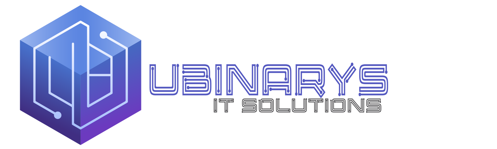

# Ubinarys Dental Cloud SaaS

<p align="center">
  
</p>

<p align="center">
  <b>Cloud-based dental practice management software for Moroccan clinics</b><br/>
  Built on IDURAR ERP/CRM (MERN stack) • Fully in French • MAD currency enforced
</p>

---

## 🦷 About

**Ubinarys Dental** is a complete dental practice management platform designed for Moroccan dental clinics. It covers patient management, appointment scheduling, treatment cataloging, invoicing in MAD (Moroccan Dirham), and detailed financial reporting.

### Key Features
- 👥 **Patient Management** — full CRM with medical history, allergies, last visit & next appointment tracking
- 📅 **Appointment Calendar** — interactive calendar view + reception daily dashboard
- 🦷 **Treatment Catalog** — 14 pre-seeded Moroccan dental treatments (Détartrage, Couronne, Implant, etc.)
- 🧾 **Invoicing** — sequential numbered invoices (YYYY/N), PDF generation, MAD currency locked
- 💬 **Quotes/Proformas** — full CRUD, convert to invoice
- 💳 **Payments** — payment tracking with modes
- 📊 **Reports** — daily cash report & monthly financial overview grouped by dentist
- 🇫🇷 **Full French UI** — complete localization (fr_fr) with French status labels
- 🔒 **MAD enforced** — currency hardcoded at model + UI level

---

## 🛠 Tech Stack

| Layer | Technology |
|---|---|
| Frontend | React 18, Ant Design 5, Vite, Redux Toolkit |
| Backend | Node.js, Express 4, Mongoose |
| Database | MongoDB Atlas |
| PDF | node-html-pdf / puppeteer |
| Auth | JWT |

---

## ⚙️ Installation & Deployment

### Operating System Support
- **Ubuntu 24.04 LTS (Noble Numbat)**
- **Ubuntu 22.04 LTS (Jammy Jellyfish)**
- Node.js runtime: **Node.js 24 LTS** (required, Node 20/22/25 are rejected)
- Database: **MongoDB Community Edition 8.0** (or 7.0+)

---

### Automated Ubuntu Installation

Run the staged Ubuntu installer from any working directory:

```bash
# Normal online installation (local MongoDB on Ubuntu server)
bash setup.sh

# With specific LAN IP pre-configured:
LAN_IP=192.168.11.117 bash setup.sh

# Non-interactive mode:
NON_INTERACTIVE=true ALLOW_DEV_SEED=true bash setup.sh
```

#### Air-Gapped / Disconnected Installation
> [!IMPORTANT]
> **Local MongoDB vs. Air-Gapped Installation**:
> - **Local MongoDB**: MongoDB runs locally on the Ubuntu host machine instead of MongoDB Atlas in the cloud. Initial package installation still downloads packages from Ubuntu, NodeSource, and MongoDB repositories over the internet.
> - **Air-Gapped Installation (`AIRGAPPED=true`)**: Complete offline isolation with zero network calls. All prerequisites (Node 24, npm 10+, mongod, mongosh, build tools, Chromium) must be pre-installed and dependencies cached.

```bash
AIRGAPPED=true bash setup.sh
```

---

### Manual Installation (Step-by-Step)

#### 1. System Packages & Node.js 24 LTS
```bash
sudo apt-get update -y
sudo apt-get install -y git curl build-essential gnupg

# Install Node.js 24 LTS
curl -fsSL https://deb.nodesource.com/setup_24.x | sudo -E bash -
sudo apt-get install -y nodejs
```

Verify versions:
```bash
node --version   # Must output v24.x.x
npm --version    # Must output 10.x.x+
```

#### 2. Install MongoDB Community Edition 8.0
Add official MongoDB 8.0 repository for Ubuntu 22.04 (jammy) or 24.04 (noble):
```bash
UBUNTU_CODENAME=$(grep -E '^VERSION_CODENAME=' /etc/os-release | cut -d'=' -f2 | tr -d '"')
ARCH=$(dpkg --print-architecture)

curl -fsSL https://www.mongodb.org/static/pgp/server-8.0.asc | \
  sudo gpg -o /usr/share/keyrings/mongodb-server-8.0.gpg --dearmor --yes

echo "deb [ arch=${ARCH} signed-by=/usr/share/keyrings/mongodb-server-8.0.gpg ] https://repo.mongodb.org/apt/ubuntu ${UBUNTU_CODENAME}/mongodb-org/8.0 multiverse" | \
  sudo tee /etc/apt/sources.list.d/mongodb-org-8.0.list

sudo apt-get update -y
sudo apt-get install -y mongodb-org mongodb-mongosh

# Start and enable MongoDB
sudo systemctl enable --now mongod
```

> [!CAUTION]
> **MongoDB LAN Security**: MongoDB must remain bound to `127.0.0.1` (localhost). **Never** expose port `27017` to the LAN or open it in UFW!

#### 3. Environment Configuration

Copy example environment files (existing `.env` files are never overwritten):
```bash
cp app/backend/.env.example app/backend/.env
cp app/frontend/.env.example app/frontend/.env
chmod 600 app/backend/.env app/frontend/.env
```

Validate `.env` formatting and secure permissions:
```bash
node app/backend/src/setup/validateEnv.js app/backend/.env
```

> [!WARNING]
> - Never duplicate variable definitions in `.env`.
> - `JWT_SECRET` must be at least 32 characters and cannot use default placeholders.
> - Do not use `https://` URLs during Vite development unless TLS certificates are configured.

#### 4. Install Dependencies & Build
```bash
npm ci
(cd app/backend && npm ci)
(cd app/frontend && npm ci && npm run build)
```

---

### Local development only

For local development with MongoDB running locally on Ubuntu:

```env
DATABASE="mongodb://127.0.0.1:27017/ubinarys?directConnection=true&serverSelectionTimeoutMS=10000"
JWT_SECRET="CHANGE_ME_TO_A_RANDOM_SECRET_AT_LEAST_32_CHARACTERS"
NODE_ENV="development"
PORT="8888"
FRONTEND_URL="http://localhost:3000"
ALLOWED_ORIGINS="http://localhost:3000,http://127.0.0.1:3000"
PUBLIC_SERVER_FILE="http://localhost:8888/"
ENABLE_DEFAULT_ADMIN="true"
```

Initialize development data and default administrator:
```bash
npm run setup:dev
```

**Development-only default administrator credentials:**
- **Email:** `admin@demo.com`
- **Password:** `Admin@2026!Local`

> [!CAUTION]
> These credentials are valid **only** when `NODE_ENV=development` and `ENABLE_DEFAULT_ADMIN=true`. They are strictly rejected in production environments.

---

### LAN Access & Multi-Computer Setup

To allow other clinic computers (e.g. reception desk & dentist chairs) on the local network (LAN) to connect:

#### Backend (`app/backend/.env`):
```env
FRONTEND_URL="http://192.168.11.117:3000"
ALLOWED_ORIGINS="http://192.168.11.117:3000,http://localhost:3000,http://127.0.0.1:3000"
PUBLIC_SERVER_FILE="http://192.168.11.117:8888/"
```

#### Frontend (`app/frontend/.env`):
```env
VITE_BACKEND_SERVER="http://192.168.11.117:8888/"
VITE_WEBSITE_URL="http://192.168.11.117:3000/"
```

> [!NOTE]
> Replace `192.168.11.117` with your Ubuntu clinic server's static LAN IP.

#### Firewall Configuration (UFW)
```bash
sudo ufw allow 3000/tcp comment "Ubinarys Dental Frontend"
sudo ufw allow 8888/tcp comment "Ubinarys Dental Backend API"
sudo ufw reload
```

#### Multi-Desktop Concurrent Access
The platform allows simultaneous active sessions from multiple desktop computers. Logging in from a second workstation maintains both sessions active independently.

---

### Initial Administrator Account (Production)
In production, set `NODE_ENV=production` and specify strong credentials:
- `INITIAL_ADMIN_EMAIL`: Your clinic admin email
- `INITIAL_ADMIN_PASSWORD`: High-entropy password (min 12 characters, uppercase, lowercase, number, special char)
- `INITIAL_ADMIN_NAME`: Administrator first name
- `INITIAL_ADMIN_SURNAME`: Administrator last name

```bash
cd app/backend && npm run setup
```

---

### Diagnostics & Health Verification

Run these standard diagnostic checks on the Ubuntu host:
```bash
# Runtimes & versions
node --version
npm --version
mongod --version

# MongoDB status & ping
systemctl status mongod --no-pager
journalctl -u mongod -n 100 --no-pager
mongosh --quiet --eval 'db.runCommand({ ping: 1 })'

# Backend health endpoints
curl -i http://127.0.0.1:8888/health/live
curl -i http://127.0.0.1:8888/health/ready
```

## 🚀 Production Deployment & Systemd Service

### Installation & Deployment
```bash
# 1. Install systemd service (runs under dedicated 'ubinarys' user)
sudo ./install-service.sh

# 2. Deploy updates safely (runs npm ci, builds frontend, restarts service)
./deploy.sh
```

### Systemd Troubleshooting & Logging
```bash
# Check service status
systemctl status ubinarys.service

# View recent log output
journalctl -u ubinarys.service -n 100 --no-pager

# Follow live systemd logs
journalctl -u ubinarys.service -f
```

---

## 📁 Project Structure

```
ubinarys-dental/
├── app/
│   ├── backend/               # Node.js + Express API
│   │   ├── src/
│   │   │   ├── controllers/   # CRUD + custom (invoice, appointment, reports)
│   │   │   ├── models/        # Mongoose schemas (Patient, Invoice, Appointment...)
│   │   │   ├── routes/        # Express routes
│   │   │   └── setup/         # Seed scripts
│   └── frontend/              # React + Ant Design SPA
│       └── src/
│           ├── pages/         # Route-level pages
│           ├── modules/       # Feature modules
│           ├── forms/         # Shared forms
│           └── locale/        # French translations (fr_fr.js)
└── docs/                      # Change log, roadmap, documentation
```

---

## 📝 Change Log

See [docs/change-log.md](docs/change-log.md) for full history.

---

## 📄 License

Private — Ubinarys IT Solutions. All rights reserved.
