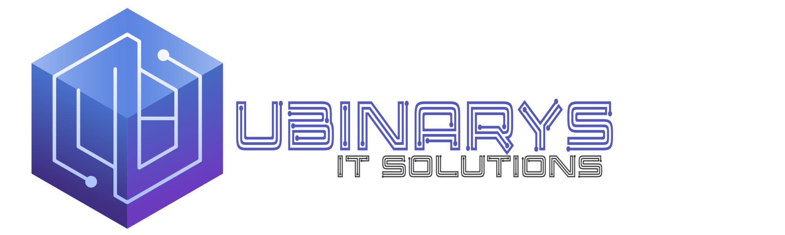

    
    <h1>Ubinarys – Cloud SaaS pour les cabinets dentaires marocains</h1>
    

        
Ubinarys | Gestion Moderne et Sécurisée

    

    

Ubinarys est une plateforme Cloud SaaS de gestion moderne pour les cabinets dentaires au Maroc. 

**Note Technique**: Built on IDURAR ERP/CRM (MERN stack).

## Features :

- **Gestion des Patients**: Dossier médical complet, historique et allergies.
- **Gestion des Rendez-vous**: Calendrier interactif et suivi des statuts.
- **Facturation & Devis**: Génération de documents aux normes marocaines (MAD).
- **Catalogue de Soins**: Gestion des actes et traitements dentaires.
- **Paiements**: Suivi des encaissements et restes à payer.

## Tech Stack
- Based on MERN Stack (Node.js / Express.js / MongoDb / React.js)
- Ant Design Framework (AntD) 🐜
- Redux for state management

## Getting started

Pour installer Ubinarys localement :

1. [Clone the repository](INSTALLATION-INSTRUCTIONS.md#step-1-clone-the-repository)
2. [Install Backend Dependencies](INSTALLATION-INSTRUCTIONS.md#Step-5-Install-Backend-Dependencies)
3. [Run Setup Script](INSTALLATION-INSTRUCTIONS.md#Step-6-Run-Setup-Script)
4. [Run the Backend Server](INSTALLATION-INSTRUCTIONS.md#Step-7-Run-the-Backend-Server)
5. [Install Frontend Dependencies](INSTALLATION-INSTRUCTIONS.md#Step-8-Install-Frontend-Dependencies)
6. [Run the Frontend Server](INSTALLATION-INSTRUCTIONS.md#Step-9-Run-the-Frontend-Server)

## License

Private — Ubinarys IT Solutions. All rights reserved.
