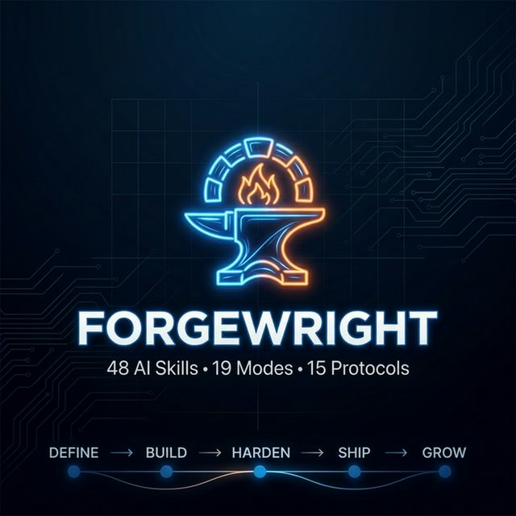

<p align="center">
  
</p>

<p align="center">
  <a href="https://opensource.org/licenses/MIT"></a>
  
  
  
  
  <a href="https://github.com/buiphucminhtam/forgewright/stargazers"></a>
</p>

<p align="center">
  
  
  
  
  
  
  
</p>

<h3 align="center">48 AI Skills · 19 Modes · 15 Protocols · Full Lifecycle Pipeline</h3>

<p align="center">
  <strong>Research → Design → Build → Test → Secure → Deploy → Market → Grow</strong><br />
  <em>The only AI pipeline that covers the complete lifecycle — from SaaS to AAA games.</em>
</p>

<p align="center">
  <sub>Built on <a href="https://github.com/nagisanzenin/claude-code-production-grade-plugin">claude-code-production-grade-plugin</a>, <a href="https://github.com/ComposioHQ/awesome-claude-skills">awesome-claude-skills</a>, and <a href="https://github.com/msitarzewski/agency-agents">agency-agents</a>. Iteratively tested and improved across real projects.</sub>
</p>

---

## ☕ Support

If Forgewright helps you ship faster, you can support the project here:


---

## Release Timeline

```
2026-03-17  v7.5  ●━━━ Web Scraper Skill (Crawl4AI) —
                  │     Security-first web scraping: 10 hard security rules,
                  │     URL validation (SSRF/LFI defense), output sanitization
                  │     (prompt injection defense), CSS-first extraction strategy.
                  │     Library-only mode (no Docker API). Integrated into
                  │     Polymath Research + AI Build pipeline. 48 total skills.
                  │
2026-03-16  v7.4  ●━━━ UI Design Database & Reasoning Engine —
                  │     85 visual styles, 161 WCAG-validated color palettes,
                  │     74 font pairings (Google Fonts + Tailwind configs),
                  │     162 contextual reasoning rules, 99 UX anti-patterns.
                  │     Style Proposal Protocol: 2-3 scored options with
                  │     reference websites (Linear, Stripe, Spotify, Apple...).
                  │     53 curated reference sites for style comparison.
                  │
2026-03-15  v7.3  ●━━━ Code Intelligence & Skill Quality —
                  │     GitNexus integration: AST → knowledge graph → MCP tools
                  │     (impact analysis, call chains, community clustering).
                  │     Skill Maker v2: eval loop, WHY-first philosophy, quality audit.
                  │     Full quality sweep: 27 fixes across 12 skills.
                  │     User-friendly install prompt for non-technical users.
                  │
2026-03-15  v7.2  ●━━━ Page Agent Patterns & Test Intelligence —
                  │     Graceful Failure protocol (retry limits, stuck detection),
                  │     ReAct structured reasoning for Debugger,
                  │     LLM Data Pipeline Safety for Security Engineer,
                  │     QA Phase 0: auto test technique assessment
                  │     (Playwright vs Midscene vs Page Agent). 13 total protocols.
                  │     Repo renamed: forge17 → forgewright.
                  │
2026-03-15  v7.1.1●━━━ Memory Manager Overhaul — TF-IDF search (cosine similarity),
                  │     value-weighted GC, markdown-aware chunking, lifecycle hooks wired,
                  │     refresh command, structured fact extraction. Zero external deps.
                  │
2026-03-14  v7.1  ●━━━ Business Analyst — Requirements gatekeeper with 6W1H elicitation,
                  │     Zero Assumption Doctrine, critical evaluation (Red Team),
                  │     strict Information Gate. New Analyze mode. 47 total skills.
                  │
2026-03-14  v7.0  ●━━━ Project Onboarding, Quality Gates & Brownfield Safety —
                  │     5 new protocols, session lifecycle, quality scoring 0-100,
                  │     brownfield safety net with git branching & regression checks.
                  │
2026-03-14  v6.1  ●━━━ Round 2 — AI Engineer, Performance, Accessibility, UX Research,
                  │     Data Engineer, Project Manager, Roblox, Godot Multiplayer
                  │     + 5 existing skill upgrades. 46 total skills.
                  │
2026-03-13  v6.0  ●━━━ Game Dev & XR — 13 skills: Unity, Unreal, Godot, Level Design,
                  │     Narrative, Technical Art, Audio, Shaders, Multiplayer, XR
                  │
2026-03-12  v5.6  ●━━━ Mobile Tester — plug-and-play AI testing on Android/iOS real devices
                  │
2026-03-12  v5.5  ●━━━ GROW Phase — Growth Marketer + Conversion Optimizer, 6-phase lifecycle
                  │
2026-03-12  v5.4  ●━━━ Vision Testing — Midscene.js AI testing, cross-platform (web+mobile)
                  │
2026-03-11  v5.3  ●━━━ Research Intelligence — NotebookLM MCP, deep research workflow
                  │
2026-03-10  v5.2  ●━━━ Parallel dispatch (git worktrees), scope analysis, anti-hallucination
                  │
2026-03-06  v5.0  ●━━━ Migrated to Antigravity, 17 skills, 12 execution modes
                  │
2026-03-04  v4.0  ●━━━ Two-wave parallelism, internal skill agents, dynamic task generation
                  │
2026-03-01  v3.0  ●━━━ Full rewrite — shared protocols, 7 parallel points
                  │
2026-02-28  v2.0  ●━━━ 13 bundled skills, unified workspace, prescriptive UX
                  │
2026-02-24  v1.0  ●━━━ Initial release — autonomous DEFINE>BUILD>HARDEN>SHIP>SUSTAIN
```

---

## Quick Start

### Option A: One-liner Setup (Recommended)

```bash
# macOS/Linux — download & install as git submodule
curl -sO https://raw.githubusercontent.com/buiphucminhtam/forgewright/main/setup.sh
chmod +x setup.sh && ./setup.sh install

# Windows (PowerShell)
Invoke-WebRequest -Uri "https://raw.githubusercontent.com/buiphucminhtam/forgewright/main/setup.ps1" -OutFile "setup.ps1"
.\setup.ps1 install
```

### Option B: Manual Git Submodule

```bash
git submodule add -b main https://github.com/buiphucminhtam/forgewright.git .antigravity/plugins/production-grade
git add .gitmodules .antigravity/ && git commit -m "feat: add forgewright v7.5"
```

### Option C: Standalone Clone

```bash
git clone https://github.com/buiphucminhtam/forgewright.git
```

Then say: *"Build a production-grade SaaS for [your idea]"* — or *"Build a game with Unity"* — or *"Help me think about [your idea]"* if you want the Polymath co-pilot first.

> **Note:** This repo was formerly named `forge17`. All existing submodule references will continue to work via GitHub redirect.

### Updating

```bash
./setup.sh update          # macOS/Linux
.\setup.ps1 update         # Windows

# Or: git submodule update --remote .antigravity/plugins/production-grade
```

---

## For Antigravity Users

Forgewright is self-discovering. Once installed, Antigravity reads `AGENTS.md` on every new chat and automatically routes your requests through the 48-skill pipeline.

**Available workflows:**

| Command | Description |
|---------|-------------|
| `/setup` | First-time install as git submodule |
| `/update` | Check for and install updates |
| `/pipeline` | Show full pipeline reference, modes, and skill list |
| `/setup-mobile-test` | Set up plug-and-play mobile testing (Android/iOS) |
| `/onboard` | Deep project analysis — creates `.forgewright/project-profile.json` |

---

## 19 Execution Modes

The orchestrator auto-classifies your request and routes to the right skills:

| User Says | Mode | Skills Activated |
|-----------|------|-----------------|
| "Build a SaaS for..." | **Full Build** | All skills, 6 phases, 3 gates |
| "Add [feature]..." | **Feature** | BA (if gaps) → PM → Architect → BE/FE → QA |
| "Review my code" | **Review** | Code Reviewer only |
| "Write tests" | **Test** | QA Engineer only |
| "Deploy / CI/CD" | **Ship** | DevOps → SRE |
| "Design UI for..." | **Design** | UX Researcher → UI Designer |
| "Build mobile app" | **Mobile** | BA (if gaps) → Mobile Engineer (+ PM, Architect) |
| "Help me think about..." | **Explore** | Polymath co-pilot |
| "Deep research on..." | **Research** | Polymath + NotebookLM MCP |
| "Optimize performance" | **Optimize** | Performance Engineer + SRE |
| "Marketing strategy for..." | **Marketing** | Growth Marketer → Conversion Optimizer |
| "Optimize conversions" | **Grow** | Conversion Optimizer → Growth Marketer |
| "Test on Android/iOS" | **Mobile Test** | Mobile Tester (AI vision on real devices) |
| "Build a game with Unity..." | **Game Build** | Game Designer → Unity Engineer → Level/Narrative/Audio |
| "Build a Roblox experience" | **Game Build** | Game Designer → Roblox Engineer |
| "Build a VR app..." | **XR Build** | XR Engineer (+ Game Build if game-like) |
| "Build AI feature / RAG..." | **AI Build** | AI Engineer + Prompt Engineer + Data Scientist |
| "Debug this / fix bug" | **Debug** | Debugger → Software/Frontend Engineer |
| "Analyze requirements..." | **Analyze** | Business Analyst (standalone) |

---

## 48 Skills — Organized by Division

### 🧠 Orchestrator & Meta (5)

| Skill | What It Does |
|-------|-------------|
| **production-grade** | Smart routing orchestrator — 19 modes, auto-classifies, dependency-based task graph |
| **polymath** | Creative partner + grounded researcher — 6 modes: research (+ NotebookLM MCP), ideate, advise, onboard, translate, synthesize |
| **parallel-dispatch** | Git worktree-based parallel execution with Task Contracts and anti-hallucination |
| **memory-manager** | Cross-session memory — TF-IDF search, value-weighted GC, lifecycle hooks |
| **skill-maker** | Self-extending system — generates custom skills with eval loop, WHY-first philosophy, quality audit (12-point checklist, A-F grades) |

### ⚙️ Core Engineering (20)

| Skill | What It Does |
|-------|-------------|
| **business-analyst** | 6W1H structured elicitation, Zero Assumption Doctrine, feasibility analysis, Information Gate |
| **product-manager** | CEO interview, domain research, BRD with user stories |
| **solution-architect** | ADRs, API contracts (OpenAPI 3.1), data models, architecture decisions |
| **software-engineer** | TDD-first, clean architecture — handlers → services → repositories |
| **frontend-engineer** | Design system, components, pages, a11y, RSC, PWA, animations |
| **qa-engineer** | Phase 0 technique assessment + full pyramid: unit, integration, E2E, Playwright, Midscene vision, Page Agent DOM, k6 performance |
| **security-engineer** | STRIDE, OWASP Top 10, auth audit, PII, supply chain, AI security, LLM data pipeline safety, runtime threat detection |
| **code-reviewer** | Architecture conformance, code quality, performance, test quality, git workflow |
| **devops** | Docker, Terraform, CI/CD, monitoring, branch strategy |
| **sre** | SLOs, error budgets, chaos engineering, runbooks, capacity planning |
| **data-scientist** | LLM optimization, A/B testing, data pipelines, prompt engineering |
| **technical-writer** | API docs, dev guides, Docusaurus, changelog generation |
| **ui-designer** | Design tokens, wireframes, component inventory, a11y guidelines, brand system. **Design Database:** 85 styles, 161 palettes, 74 font pairings, reasoning engine, Style Proposal Protocol with reference websites |
| **mobile-engineer** | React Native / Flutter, navigation, native integrations, app store prep |
| **mobile-tester** | Plug-and-play AI testing on Android/iOS real devices via Midscene.js |
| **api-designer** | REST/GraphQL API design, endpoints, error taxonomy |
| **database-engineer** | Schema design, migrations, query optimization |
| **debugger** | Bug investigation, ReAct structured reasoning, root cause analysis, regression testing |
| **prompt-engineer** | Prompt design, evaluation harness, optimization, guardrails |
| **project-manager** | Sprint planning, velocity tracking, risk management, stakeholder comms |

### 🤖 AI/ML & Data (3)

| Skill | What It Does |
|-------|-------------|
| **ai-engineer** | MLOps, model serving, fine-tuning, RAG optimization, evaluation frameworks, cost tracking |
| **performance-engineer** | Load testing (k6), profiling, Core Web Vitals, bottleneck analysis, Lighthouse CI |
| **data-engineer** | ETL/ELT pipelines, medallion architecture, dbt, data quality, Airflow/Dagster |
| **web-scraper** | Security-first web crawling (crawl4ai), URL validation, SSRF defense, output sanitization, CSS/LLM extraction, deep crawling |

### ♿ Accessibility & UX (2)

| Skill | What It Does |
|-------|-------------|
| **accessibility-engineer** | WCAG 2.2 AA/AAA audit, keyboard navigation, screen reader testing, ARIA patterns |
| **ux-researcher** | User interviews, usability testing, personas, journey maps, heuristic evaluation |

### 🎮 Game Development (15)

| Skill | What It Does |
|-------|-------------|
| **game-designer** | GDD, gameplay loops, economy, mechanic specs (engine-agnostic) |
| **unity-engineer** | C# game architecture, ScriptableObjects, Editor tools, platform optimization |
| **unreal-engineer** | C++/Blueprint, GAS, Nanite/Lumen, replication-ready code |
| **godot-engineer** | GDScript/C#, scene tree, signals, cross-platform export |
| **godot-multiplayer** | MultiplayerSpawner, ENet/WebSocket, client prediction, dedicated server |
| **roblox-engineer** | Luau, DataStore, server-authoritative architecture, monetization |
| **level-designer** | Spatial design, encounters, pacing, environmental storytelling |
| **narrative-designer** | Branching dialogue (Ink/Yarn), character voice, lore, narrative-gameplay integration |
| **technical-artist** | Shaders (HLSL), VFX, LOD optimization, performance budgets, art tools |
| **game-audio-engineer** | Spatial audio, adaptive music, SFX, Wwise/FMOD integration |
| **unity-shader-artist** | Shader Graph, HLSL, VFX Graph, URP/HDRP post-processing |
| **unity-multiplayer** | Netcode for GameObjects, Relay, Lobby, prediction |
| **unreal-technical-artist** | Niagara VFX, Material Editor, Lumen/Nanite optimization |
| **unreal-multiplayer** | Replication, dedicated server, GAS networking |
| **xr-engineer** | AR/VR/MR — spatial UI/UX, hand tracking, comfort, Quest/Vision Pro/WebXR |

### 📈 Growth (2)

| Skill | What It Does |
|-------|-------------|
| **growth-marketer** | Market analysis, SEO, AI search optimization, copywriting, launch campaigns |
| **conversion-optimizer** | Funnel CRO, A/B testing, growth loops, churn prevention, dunning |

---

## How It Works

```
DEFINE → BUILD → HARDEN → SHIP → SUSTAIN → GROW
```

You give a high-level vision. 48 specialized skills handle everything else.

### The Pipeline

```
Polymath (pre-flight: research, gap detection, context building)
    ↓
T0.5: Business Analyst (6W1H elicitation, feasibility, Information Gate) — conditional
    ↓
T1:   Product Manager (BRD) ─────────────── GATE 1: approve requirements
T1.5: UI Designer (design tokens, wireframes)
T2:   Solution Architect ────────────────── GATE 2: approve architecture
    ↓
T3a: Backend Engineer ──── implements services      ┐
T3b: Frontend Engineer ─── implements pages         ├ parallel (worktrees)
T3c: Mobile Engineer ───── mobile app (conditional) ┘
T4:  DevOps ────────────── Dockerfiles + CI skeleton
    ↓ (code written — validated & merged)
T5:  QA Engineer ─────────── tests (unit/e2e/perf)  ┐
T6a: Security Engineer ──── STRIDE + code audit     ├ parallel (worktrees)
T6b: Code Reviewer ──────── arch conformance review ┘
    ↓
T7:  DevOps (IaC + CI/CD + branch strategy)
T8:  Remediation
T9:  SRE (SLOs + chaos)
T10: Data Scientist (conditional — LLM/ML/AI projects)
    ↓ ─────────────────────────── GATE 3: approve production readiness
T11: Technical Writer (+ changelog generation)
T12: Skill Maker
T13: Growth Marketer ──────── go-to-market strategy, SEO, content
T14: Conversion Optimizer ── funnel CRO, A/B testing, growth loops
```

**3 approval gates. Parallel or sequential execution. Scope analysis with risk prediction.**

### Game Build Pipeline

```
Game Designer (GDD, mechanics, economy)
    ↓
Engine Engineer ──── Unity / Unreal / Godot / Roblox
    ↓
Level Designer ────── environments, encounters, pacing    ┐
Narrative Designer ── dialogue, lore, character voice     ├ parallel
Technical Artist ──── shaders, VFX, LOD, performance     │
Game Audio Engineer ─ spatial audio, adaptive music       ┘
    ↓
Engine Multiplayer ── networking (if multiplayer)
    ↓
QA Engineer ─────────── game testing
    ↓
Ship
```

### XR Build Pipeline

```
XR Engineer (spatial UI/UX, comfort, platform selection)
    ↓
Game Build pipeline (if game-like XR experience)
    ↓ or
Frontend/Software Engineer (if utility XR app)
```

### Parallel Dispatch (v5.2)

```
CEO Agent (Orchestrator)
    │
    ├── Scope Analysis → Complexity Score, Time Estimate, Risk Level
    │
    ├── Task Contract ──→ Worktree 1: Backend  (services/)
    ├── Task Contract ──→ Worktree 2: Frontend (frontend/)
    ├── Task Contract ──→ Worktree 3: Mobile   (mobile/)
    │
    ├── Validate each worker (7-step anti-hallucination)
    └── Merge Arbiter → Clean merge into main
```

### Research Intelligence (v5.3)

```
┌─────────────────────────────────────────────────────┐
│                 Research Pipeline                     │
│                                                       │
│  Phase 1: Web Search (search_web)       ← ALWAYS ON  │
│  Phase 2: NotebookLM MCP (optional)  ← GROUNDED AI   │
│  Phase 3: Synthesize → Citations + Recommendations    │
│                                                       │
│  ⚡ Fallback: Phase 2 fails? Phase 1 still works.     │
└─────────────────────────────────────────────────────┘
```

### Project Onboarding & Quality Gates (v7.0+)

```
┌──────────────────────────────────────────────────────────┐
│               Project Onboarding (v7.3)                    │
│                                                            │
│  Phase 1:   Fingerprint ── tech stack, framework, CI       │
│  Phase 1.5: Code Intelligence ── GitNexus knowledge graph  │
│             🧠 255 symbols · 383 relationships · 7 clusters│
│             → impact(), context(), query() for all skills  │
│             → User-friendly install prompt if not found     │
│  Phase 2:   Health Check ── build, tests, lint, CVEs       │
│  Phase 3:   Pattern Analysis ── naming, style, arch        │
│  Phase 4:   Risk Assessment ── tech debt, protected        │
│  Phase 5:   Profile → .forgewright/project-profile.json        │
│                                                            │
│  📊 Quality Gate: runs after EVERY skill output            │
│  Level 1: Build     │ Level 2: Regression (brownfield)     │
│  Level 3: Standards │ Level 4: Traceability                │
│  Score: 0-100 │ Grade: A-F │ Threshold: configurable       │
│                                                            │
│  🛡️ Brownfield Safety: git branch + baseline + rollback    │
└──────────────────────────────────────────────────────────┘
```

---

## By the Numbers

| Metric | Detail |
|--------|--------|
| **48 specialized skills** | Each with sole authority over its domain |
| **19 execution modes** | Full Build, Feature, Harden, Ship, Test, Review, Architect, Document, Explore, Research, Optimize, Design, Mobile, Mobile Test, Marketing, Grow, **Game Build**, **XR Build**, **Analyze** |
| **6-phase pipeline** | DEFINE → BUILD → HARDEN → SHIP → SUSTAIN → GROW |
| **4 game engines** | Unity, Unreal Engine, Godot, Roblox |
| **XR platforms** | Quest, Vision Pro, WebXR, PCVR |
| **Research Intelligence** | NotebookLM MCP — zero-hallucination, citation-backed |
| **Code Intelligence** | GitNexus knowledge graph — impact analysis, call chains, community clustering, pre-commit risk |
| **Design Database** | 85 styles, 161 WCAG palettes, 74 font pairings, 162 reasoning rules, 53 reference websites — data-driven style proposals |
| **Smart Test Selection** | Phase 0: auto-assess target → recommend Playwright / Midscene / Page Agent |
| **Vision Testing** | Midscene.js — AI-powered, cross-platform (web + Android + iOS) |
| **Go-to-Market** | SEO, AEO/GEO, copywriting, campaigns, funnel CRO, A/B testing |
| **Parallel dispatch** | Git worktree-based with anti-hallucination pipeline |
| **3 approval gates** | Everything between gates is fully autonomous |
| **15 shared protocols** | UX, input validation, tool efficiency, conflict resolution, task contracts, project onboarding, session lifecycle, quality gate, brownfield safety, quality dashboard, graceful failure, code intelligence, paperclip integration |
| **Quality scoring** | 0-100 per-skill scoring with A-F grades, cross-session trending |
| **Persistent memory** | TF-IDF search, auto-refresh, lifecycle hooks — survives session resets |
| **4 engagement modes** | Express, Standard, Thorough, Meticulous |

---

## Full Power Setup

Forgewright works out of the box with just **Step 1**. Each additional step unlocks more capabilities — install as many as you want.

### Power Levels

| Level | What You Get | Steps Needed |
|-------|-------------|-------------|
| ⚡ **Basic** (48 skills) | Full pipeline: DEFINE → BUILD → HARDEN → SHIP | Step 1 only |
| ⚡⚡ **Smart** (+code understanding) | Blast radius analysis, safe refactoring, call chain tracing | + Step 2 |
| ⚡⚡⚡ **Persistent** (+cross-session memory) | Remembers decisions, blockers, progress across sessions | + Step 3 |
| ⚡⚡⚡⚡ **Research** (+grounded research) | NotebookLM podcasts, source analysis, deep research | + Step 4 |
| ⚡⚡⚡⚡⚡ **Full Power** (+scraping +testing +multi-agent) | Web crawling, AI vision testing, autonomous agent teams | + Steps 5-7 |

---

### Step 1 — Install Forgewright (Required)

> **Prerequisites:** Git, [Antigravity](https://antigravity.google) or Gemini CLI

```bash
# macOS/Linux — one-liner
curl -sO https://raw.githubusercontent.com/buiphucminhtam/forgewright/main/setup.sh
chmod +x setup.sh && ./setup.sh install

# Windows (PowerShell)
Invoke-WebRequest -Uri "https://raw.githubusercontent.com/buiphucminhtam/forgewright/main/setup.ps1" -OutFile "setup.ps1"
.\setup.ps1 install

# Or: manual git submodule
git submodule add -b main https://github.com/buiphucminhtam/forgewright.git .antigravity/plugins/production-grade
```

✅ **Verify:** Open Antigravity, type anything — Forgewright auto-routes through the orchestrator.

🔓 **Unlocks:** 48 skills, 19 modes, 15 protocols, full lifecycle pipeline.

---

### Step 2 — Code Intelligence via GitNexus (Recommended)

> **Prerequisites:** Node.js 18+

[GitNexus](https://github.com/abhigyanpatwari/GitNexus) builds a knowledge graph of your codebase — symbols, call chains, execution flows. Forgewright auto-reindexes at session start and end.

```bash
# Install and index your project
npm install -g gitnexus
npx gitnexus analyze

# Optional: Add MCP server to Antigravity settings
# "gitnexus": { "command": "npx", "args": ["gitnexus", "mcp"] }
```

✅ **Verify:** `npx gitnexus status` — shows symbol count and index freshness.

🔓 **Unlocks:** `impact()` blast radius, `context()` 360° symbol view, `detect_changes()` pre-commit risk, `rename()` safe multi-file rename.

> Auto-refresh: Forgewright reindexes automatically — no manual `analyze` needed after first setup.

---

### Step 3 — Persistent Memory via mem0 (Recommended)

> **Prerequisites:** Python 3.8+ (stdlib only, zero pip dependencies)

Cross-session memory so Forgewright remembers decisions, blockers, and progress.

```bash
# Initialize (run from Forgewright directory)
python3 scripts/mem0-cli.py setup

# Ingest current project state
python3 scripts/mem0-cli.py refresh
```

✅ **Verify:** `python3 scripts/mem0-cli.py stats` — shows memory count and categories.

🔓 **Unlocks:** Decision recall across sessions, blocker tracking, auto-resume interrupted pipelines, TF-IDF semantic search, value-weighted garbage collection.

---

### Step 4 — Research Intelligence via NotebookLM MCP (Optional)

> **Prerequisites:** Google account, Python 3.10+

Gives Polymath skill deep research capabilities — grounded analysis with real sources.

```bash
pip install notebooklm-mcp
nlm login

# Add to MCP config:
# "notebooklm": { "command": "nlm", "args": ["mcp"] }
```

✅ **Verify:** Say *"Deep research on [topic]"* — creates notebook, adds sources, synthesizes findings.

🔓 **Unlocks:** Grounded research, podcast generation, study guides, mind maps, flashcards, slide decks, source querying.

---

### Step 5 — Web Scraping via crawl4ai (Optional)

> **Prerequisites:** Python 3.10+

Secure web crawling for JS-rendered sites that `read_url_content` can't handle.

```bash
pip install "crawl4ai>=0.8.0"
```

✅ **Verify:** Auto-detected. Say *"Scrape [URL]"* or *"Crawl [website]"*.

🔓 **Unlocks:** JS-rendered page crawling, CSS/LLM extraction, deep crawling (50 pages, 3 levels), SSRF protection.

---

### Step 6 — AI Vision Testing via Midscene.js (Optional)

> **Prerequisites:** Node.js 18+, Android device/emulator or iOS simulator

AI-powered visual testing on real devices — tap, swipe, and verify screens with natural language.

```bash
npm install -g @anthropic-ai/midscene

# Android: verify device
adb devices

# iOS (macOS only): verify simulator
xcrun simctl list
```

✅ **Verify:** Say *"Test on Android"* or *"Test on iOS"* — launches Mobile Tester skill.

🔓 **Unlocks:** AI vision testing on real devices, natural language test steps, cross-platform screenshot comparison.

---

### Step 7 — Multi-Agent via Paperclip (Optional)

> **Prerequisites:** Node.js 20+, pnpm 9.15+

Multiple AI agents working as a company — goals, tickets, budgets, heartbeat scheduling.

```bash
npx paperclipai onboard --yes
cd paperclip && pnpm dev
# Dashboard: http://localhost:3100
```

✅ **Verify:** Open `http://localhost:3100` — Paperclip dashboard appears.

🔓 **Unlocks:** Multi-agent coordination, automated ticket assignment, agents work while you sleep, budget tracking.

> Forgewright auto-detects Paperclip context and switches to Express mode (fully autonomous).

---

### Quick Reference

| Platform | Install | Update | Status | Uninstall |
|----------|---------|--------|--------|-----------|
| **macOS/Linux** | `./setup.sh install` | `./setup.sh update` | `./setup.sh status` | `./setup.sh uninstall` |
| **Windows** | `.\setup.ps1 install` | `.\setup.ps1 update` | `.\setup.ps1 status` | `.\setup.ps1 uninstall` |

### Custom Config (`.production-grade.yaml`)

```yaml
version: "7.0"

project:
  name: "my-project"
  language: "typescript"        # typescript | go | python | rust | java | c++ | c# | gdscript | luau
  framework: "nestjs"           # nestjs | express | fastapi | gin | spring | unity | unreal | godot | roblox
  cloud: "aws"                  # aws | gcp | azure

paths:
  services: "services/"
  frontend: "frontend/"
  mobile: "mobile/"
  tests: "tests/"

features:
  frontend: true
  mobile: false
  game_dev: false               # auto-detected from engine mentions
  xr: false                     # auto-detected from VR/AR mentions
  ai_ml: false                  # auto-detected from imports

# v7.0: Quality gate configuration
quality:
  minimum_score: 70             # warn below this
  block_score: 60               # stop below this
  strict_mode: false            # if true, Level 3 violations also block

# v7.0: Brownfield safety configuration
brownfield:
  auto_branch: true             # create session branch automatically
  baseline_tests: true          # run existing tests before pipeline
  change_manifest: true         # track all file changes
```

### Partial Execution

| Command | What Runs |
|---------|-----------|
| `"Just define"` | BA (if gaps) → PM + UI Designer + Architect |
| `"Just build"` | Backend + Frontend + Mobile |
| `"Just harden"` | QA + Security + Code Review |
| `"Just ship"` | IaC + CI/CD + SRE |
| `"Deep research on..."` | Polymath + NotebookLM MCP |
| `"Design UI for..."` | UX Researcher → UI Designer |
| `"Analyze requirements"` | Business Analyst (standalone) |
| `"Build a game with Godot"` | Game Designer → Godot Engineer → Level/Audio |
| `"Marketing strategy"` | Growth Marketer → Conversion Optimizer |
| `"Test on Android/iOS"` | Mobile Tester (AI vision) |
| `"Set up Paperclip"` | Multi-agent orchestration (optional) |

---

## Conflict Resolution

Each domain has one authority. No overlap, no contradictions.

| Domain | Authority | Others Must Not |
|--------|-----------|-----------------|
| OWASP, STRIDE, PII | **security-engineer** | code-reviewer skips security |
| SLOs, error budgets | **sre** | devops skips SLO definitions |
| Code quality, arch conformance | **code-reviewer** | produces findings only, no code changes |
| Design tokens, UX patterns | **ui-designer** | frontend/mobile consumes, doesn't replace |
| Game design, mechanics | **game-designer** | engine engineers implement, don't redesign |
| ML production systems | **ai-engineer** | data-scientist focuses on research/experiments |
| Accessibility auditing | **accessibility-engineer** | frontend implements, a11y engineer audits |
| Performance testing | **performance-engineer** | SRE focuses on reliability, not profiling |

---

## Examples

```bash
# Greenfield SaaS (full pipeline, 48 skills)
"Build a production-grade SaaS for multi-vendor e-commerce
 with seller dashboards, buyer marketplace, and payment processing."

# Unity Game (Game Build mode)
"Build a 3D platformer game with Unity — tight controls,
 level progression, collectibles, and multiplayer co-op."

# Roblox Experience
"Build a Roblox obby experience with leaderboards,
 in-game shop, and social features."

# Unreal Engine AAA
"Build an Unreal Engine 5 third-person shooter with
 GAS-based abilities, multiplayer, and Nanite environments."

# VR App (XR Build mode)
"Build a VR meditation app for Quest 3 with
 spatial audio, hand tracking, and guided sessions."

# AI/ML Feature (AI Build mode)
"Build a RAG-powered customer support chatbot with
 fine-tuned embeddings and evaluation framework."

# Deep Research (NotebookLM MCP)
"Deep research on real-time collaborative editing architectures.
 Compare CRDT vs OT with real-world case studies."

# Explore first, build later
"Help me think about building a restaurant management platform."

# Marketing & Growth
"Create a go-to-market strategy for my SaaS launch.
 Include SEO audit, email sequences, and launch plan."

# Requirements Analysis (Analyze mode)
"Analyze requirements — the client wants a booking system
 with online payments and calendar integration."
```

---

## FAQ

**How many skills does Forgewright have?**
48 specialized skills covering requirements analysis, software engineering, game development (Unity, Unreal, Godot, Roblox), XR (AR/VR/MR), AI/ML, data engineering, web scraping, accessibility, UX research, and go-to-market.

**Can it build complete games?**
Yes. The Game Build mode orchestrates game-specific skills: Game Designer → Engine Engineer → Level Designer → Narrative → Technical Art → Audio → QA. Supports Unity, Unreal Engine, Godot, and Roblox.

**Does it write working code?**
Yes. Every skill: write, build, test, debug, fix. No stubs. No TODOs.

**Can I use it on existing projects?**
Yes. Run `/onboard` first — Forgewright will analyze your project, learn your coding patterns, and create a safety net (git branch + test baseline). Then run any mode: `"add feature"`, `"harden"`, `"write tests"`. Existing tests are verified after every change.

**Is NotebookLM MCP required?**
No. Optional enhancement. When available, research quality gets zero hallucinations + citations.

**Is Midscene required?**
No. Playwright is the primary CI testing tool. Midscene is optional for visual QA and mobile testing.

**What languages are supported?**
TypeScript, Go, Python, Rust, Java, C++ (Unreal), C# (Unity), GDScript (Godot), Luau (Roblox).

**Do I need all 48 skills?**
No. The orchestrator only activates what you need. A backend API may use 8 skills. A full game may use 20+. The BA skill only activates when information gaps are detected.

**What is Code Intelligence?**
Built-in knowledge graph engine (powered by [GitNexus](https://github.com/abhigyanpatwari/GitNexus)) that indexes your codebase's AST, maps call chains, clusters functional areas, and provides impact analysis. Install via `npm install -g gitnexus` — during `/onboard`, if GitNexus isn't found, Forgewright pauses and guides you through installation step by step (including Node.js setup for non-technical users). Once indexed, all skills gain 360° awareness: know exactly which files break when you change a function, trace call chains for debugging, and detect pre-commit risk.

**What is Page Agent DOM testing?**
A lightweight technique from Alibaba that converts DOM to text instead of screenshots. Works with text-only LLMs (like MiniMax), costs ~$0.001/step. QA Phase 0 auto-recommends it when appropriate.

**What happened to forge17?**
Renamed to Forgewright in v7.2. The GitHub redirect ensures existing submodule references continue to work.

**How does parallel dispatch work?**
Independent tasks run in git worktrees. A 7-step anti-hallucination validator checks each worker before merging.

---

## Contributing

1. Fork the repo
2. Create a branch: `git checkout -b feature/your-feature`
3. Commit using [Conventional Commits](https://www.conventionalcommits.org/): `feat(skill): add new capability`
4. Open a Pull Request

**Adding a skill:** Create `skills/your-skill-name/SKILL.md` with `---` frontmatter. See any existing skill as a reference.

---

## License

MIT

---

## Star History

<a href="https://www.star-history.com/?repos=buiphucminhtam%2Fforgewright&type=date&legend=top-left">
 <picture>
   <source media="(prefers-color-scheme: dark)" srcset="https://api.star-history.com/image?repos=buiphucminhtam/forgewright&type=date&theme=dark&legend=top-left" />
   <source media="(prefers-color-scheme: light)" srcset="https://api.star-history.com/image?repos=buiphucminhtam/forgewright&type=date&legend=top-left" />
   
 </picture>
</a>

---

<p align="center">
  <strong>Forgewright — 48 AI skills. 19 modes. 15 protocols. Code Intelligence. SaaS to AAA games. One prompt. ⭐</strong>
</p>
<p align="center">
  <em>Understand relationships, not just files. Validate with zero assumptions. Research with zero hallucinations. Build games across 4 engines. Ship with quality scoring. Grow with data.</em>
</p>
