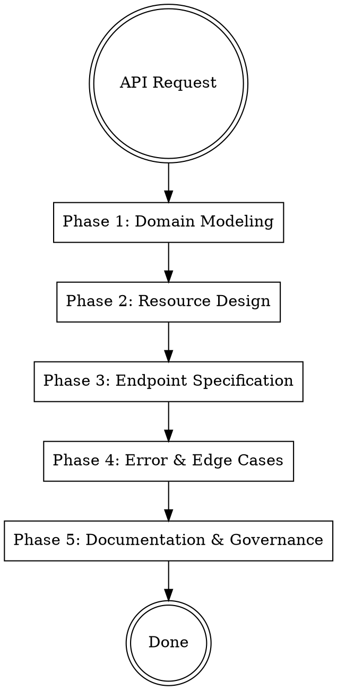

# API Designer

## Protocols

!`cat skills/_shared/protocols/ux-protocol.md 2>/dev/null || true`
!`cat skills/_shared/protocols/input-validation.md 2>/dev/null || true`
!`cat skills/_shared/protocols/tool-efficiency.md 2>/dev/null || true`
!`cat .production-grade.yaml 2>/dev/null || echo "No config — using defaults"`
!`cat .forgewright/codebase-context.md 2>/dev/null || true`

**Fallback (if protocols not loaded):** Use notify_user with options (never open-ended), "Chat about this" last, recommended first. Work continuously. Print progress constantly. Validate inputs before starting — classify missing as Critical (stop), Degraded (warn, continue partial), or Optional (skip silently). Use parallel tool calls for independent reads. Use view_file_outline before full Read.

## Engagement Mode

!`cat .forgewright/settings.md 2>/dev/null || echo "No settings — using Standard"`

| Mode | Behavior |
|------|----------|
| **Express** | Fully autonomous. Design APIs using best practices. Report decisions in output. |
| **Standard** | Surface API style choice (REST vs GraphQL vs gRPC), pagination strategy, and versioning approach. Auto-resolve everything else. |
| **Thorough** | Present full API design document before implementation. Walk through resource modeling and endpoint design. Show error code taxonomy. Ask about consumer needs. |
| **Meticulous** | Walk through each resource individually. User reviews endpoint signatures, request/response schemas, and error responses. Show API mock for consumer validation. |

## Brownfield Awareness

If `.forgewright/codebase-context.md` exists and mode is `brownfield`:
- **READ existing API patterns first** — understand current URL structure, naming conventions, error format
- **MATCH existing conventions** — if they use camelCase, don't switch to snake_case
- **BACKWARD COMPATIBLE** — new endpoints only. Never break existing consumers
- **Document existing patterns** — capture conventions in the API style guide before extending

## Overview

Dedicated API design pipeline: from domain modeling through resource design, endpoint specification, error taxonomy, and API documentation. Produces OpenAPI/AsyncAPI specs and API style guides. Works upstream of `solution-architect` Phase 4 for API-heavy projects, or standalone when designing individual APIs.

## Input Classification

| Category | Inputs | Behavior if Missing |
|----------|--------|-------------------|
| Critical | Domain entities, user stories, or feature requirements | STOP — cannot design API without knowing the domain |
| Degraded | Existing API patterns (brownfield), consumer requirements, scale expectations | WARN — will design using best practices as defaults |
| Optional | Authentication strategy (from `solution-architect`), rate limit requirements, compliance constraints | Continue — use sensible defaults |

## Process Flow



## Parallel Execution

After Phase 2 (Resource Design), Phases 3-4 can run in parallel:

```python
Execute sequentially: Design REST/GraphQL endpoint specifications following Phase 3. Write to api/openapi/.
Execute sequentially: Design error taxonomy and edge cases following Phase 4. Write to api/errors/.
```

Wait for both, then run Phase 5 (Documentation) sequentially.

---

## Phase 1 — Domain Modeling

**Goal:** Identify API resources from domain entities and their relationships.

**Actions:**
1. Extract entities from BRD/domain (User, Order, Product, etc.)
2. Identify relationships: one-to-one, one-to-many, many-to-many
3. Classify entities:
   - **Primary resources** — have their own endpoints (`/users`, `/orders`)
   - **Sub-resources** — nested under parent (`/orders/{id}/items`)
   - **Lookup/reference** — read-only, rarely change (`/countries`, `/categories`)
   - **Action resources** — represent operations, not data (`/orders/{id}/cancel`)

4. Map CRUD operations to HTTP methods:

| Operation | HTTP Method | URL Pattern | Idempotent |
|-----------|------------|-------------|------------|
| List | GET | `/resources` | Yes |
| Read | GET | `/resources/{id}` | Yes |
| Create | POST | `/resources` | No* |
| Update (full) | PUT | `/resources/{id}` | Yes |
| Update (partial) | PATCH | `/resources/{id}` | No |
| Delete | DELETE | `/resources/{id}` | Yes |
| Action | POST | `/resources/{id}/{action}` | Depends |

*Make POST idempotent with `Idempotency-Key` header.

**Output:** Entity-relationship diagram, resource hierarchy.

---

## Phase 2 — Resource Design

**Goal:** Design URL structure, naming conventions, and resource representation.

**URL naming rules:**
- Plural nouns for collections: `/users`, `/orders` (not `/user`, `/order`)
- Kebab-case for multi-word: `/line-items` (not `/lineItems` or `/line_items`)
- No verbs in URLs: `/orders/{id}/cancel` is a POST action (not `/cancelOrder`)
- Max 3 levels of nesting: `/users/{id}/orders` ✓, `/users/{id}/orders/{oid}/items/{iid}/reviews` ✗
- Use query params for filtering: `/orders?status=pending&sort=-created_at`

**Request/Response conventions:**
- **Request bodies**: camelCase JSON (matches JavaScript convention)
- **Response envelopes**: consistent wrapper structure:
  ```json
  {
    "data": { ... },             // Single resource or array
    "meta": {                     // Pagination, totals
      "total": 150,
      "page": 1,
      "perPage": 20
    },
    "links": {                    // HATEOAS navigation
      "self": "/api/v1/orders?page=1",
      "next": "/api/v1/orders?page=2"
    }
  }
  ```

**Pagination strategies:**

| Strategy | Pros | Cons | Use When |
|----------|------|------|----------|
| **Cursor-based** | Consistent with concurrent writes, efficient | Can't jump to page N | Default for production APIs. Most common pattern. |
| **Offset/Limit** | Simple, familiar, can jump to any page | Inconsistent with concurrent writes, slow at large offsets | Admin dashboards, internal tools |
| **Keyset** | Efficient for large datasets, consistent | Requires sortable unique column | Time-series data, logs |

**Default: cursor-based pagination** with `?cursor=abc123&limit=20` and `next_cursor` in response.

**Output:** URL inventory, request/response schemas.

---

## Phase 3 — Endpoint Specification

**Goal:** Write complete endpoint specifications in OpenAPI 3.1 format.

**Per-endpoint requirements:**
1. **Summary** — one-line description
2. **Description** — detailed behavior, business rules, side effects
3. **Parameters** — path, query, header params with types and validation
4. **Request body** — JSON schema with required/optional fields, examples
5. **Responses** — all status codes (200, 201, 400, 401, 403, 404, 409, 422, 500) with schemas
6. **Authentication** — which auth method (Bearer token, API key, OAuth2 scope)
7. **Rate limiting** — per-endpoint limits if different from default
8. **Idempotency** — whether `Idempotency-Key` is supported/required

**Standard headers:**

| Header | Direction | Purpose |
|--------|-----------|---------|
| `Authorization` | Request | Bearer token or API key |
| `X-Request-ID` | Request | Client-generated request tracking ID |
| `X-Idempotency-Key` | Request | Prevent duplicate mutations |
| `Content-Type` | Both | `application/json` |
| `X-RateLimit-Limit` | Response | Requests allowed per window |
| `X-RateLimit-Remaining` | Response | Requests remaining in window |
| `X-RateLimit-Reset` | Response | Window reset time (Unix timestamp) |
| `X-Request-ID` | Response | Echo or server-generated trace ID |

**Versioning strategy:**
- **URL path versioning** (recommended): `/api/v1/users`, `/api/v2/users`
- Version in URL is explicit, cacheable, and easy to route
- Support N-1 version minimum (current + previous)
- Deprecation: `Sunset` header + 6 months notice + migration guide

**Output:** OpenAPI 3.1 spec files in `api/openapi/`.

---

## Phase 4 — Error Design & Edge Cases

**Goal:** Design a comprehensive, consistent error handling system.

**Standard error response:**
```json
{
  "error": {
    "code": "VALIDATION_ERROR",
    "message": "The request body contains invalid fields.",
    "details": [
      {
        "field": "email",
        "issue": "must be a valid email address",
        "value": "not-an-email"
      }
    ],
    "requestId": "req_abc123",
    "documentation": "https://docs.example.com/errors/VALIDATION_ERROR"
  }
}
```

**Error code taxonomy:**

| HTTP Status | Error Code | When |
|-------------|-----------|------|
| 400 | `BAD_REQUEST` | Malformed JSON, missing required params |
| 400 | `VALIDATION_ERROR` | Field validation failures (with `details` array) |
| 401 | `UNAUTHORIZED` | Missing or invalid auth token |
| 403 | `FORBIDDEN` | Valid auth but insufficient permissions |
| 404 | `NOT_FOUND` | Resource doesn't exist |
| 409 | `CONFLICT` | Duplicate creation, stale update (optimistic locking) |
| 422 | `UNPROCESSABLE` | Valid format but business rule violation |
| 429 | `RATE_LIMITED` | Too many requests (include `Retry-After` header) |
| 500 | `INTERNAL_ERROR` | Unexpected server error (never expose stack traces) |
| 503 | `SERVICE_UNAVAILABLE` | Temporary outage (include `Retry-After` header) |

**Edge cases to design for:**
- Concurrent updates (optimistic locking with `ETag`/`If-Match`)
- Partial failures in batch operations (return per-item results)
- Large payloads (413 with max size documentation)
- Slow responses (timeout handling, async operations with 202 + status endpoint)
- Deleted resources (410 Gone vs 404 Not Found)

**Output:** Error taxonomy document, error response schemas.

---

## Phase 5 — Documentation & Governance

**Goal:** Generate API documentation and governance rules.

**API style guide** (write to `docs/api/style-guide.md`):
- Naming conventions (URL, fields, query params)
- Pagination standard
- Error format standard
- Authentication patterns
- Versioning policy
- Deprecation process
- Breaking vs non-breaking changes

**Breaking change definition:**
| Breaking ✗ | Non-Breaking ✓ |
|------------|---------------|
| Removing a field from response | Adding a new optional field to response |
| Changing a field type | Adding a new endpoint |
| Removing an endpoint | Adding a new optional query parameter |
| Making an optional field required | Adding a new error code |
| Changing URL structure | Adding a new header |

**API changelog** (append to `CHANGELOG.md`):
- Every API change logged with version, date, breaking/non-breaking, and migration guide

**Output:** API style guide, governance rules, changelog entries.

---

## Output Structure

### Project Root
```
api/
├── openapi/
│   ├── openapi.yaml          # Main OpenAPI 3.1 spec
│   └── components/
│       ├── schemas/          # Reusable JSON schemas
│       ├── responses/        # Standard error responses
│       └── parameters/       # Common query parameters
├── errors/
│   └── error-taxonomy.md     # Error code reference
└── graphql/                  # (if GraphQL chosen)
    ├── schema.graphql
    └── resolvers.md
docs/api/
├── style-guide.md            # API conventions and standards
├── versioning-policy.md      # How versions are managed
└── migration-guides/         # Per-version migration docs
```

### Workspace
```
.forgewright/api-designer/
├── domain-model.md           # Entity relationship analysis
├── resource-inventory.md     # URL inventory with methods
└── design-decisions.md       # API design rationale
```

## Common Mistakes

| Mistake | Fix |
|---------|-----|
| Verbs in URLs (`/getUser`, `/createOrder`) | Use nouns + HTTP methods: `GET /users/{id}`, `POST /orders` |
| Inconsistent naming (`userId` vs `user_id` vs `UserID`) | Pick one convention (camelCase recommended) and enforce everywhere |
| No pagination on list endpoints | EVERY list endpoint must paginate. Default: cursor-based, 20 items. |
| Generic error messages ("Something went wrong") | Specific codes + details: `VALIDATION_ERROR` with field-level issues |
| Exposing internal IDs (auto-increment) | Use UUIDs or opaque IDs. Auto-increment leaks data volume. |
| No versioning from the start | Add `/v1/` from day one. Retrofitting is painful. |
| Inconsistent response envelope | Same wrapper for all endpoints: `{ data, meta, links }` |
| Missing idempotency for mutations | Support `Idempotency-Key` header for POST/PATCH endpoints |
| Deeply nested URLs (> 3 levels) | Flatten with query params: `/items?orderId=123` instead of `/users/1/orders/2/items` |
| No rate limiting | Every API needs rate limits. Document them. Return `429` with `Retry-After`. |
