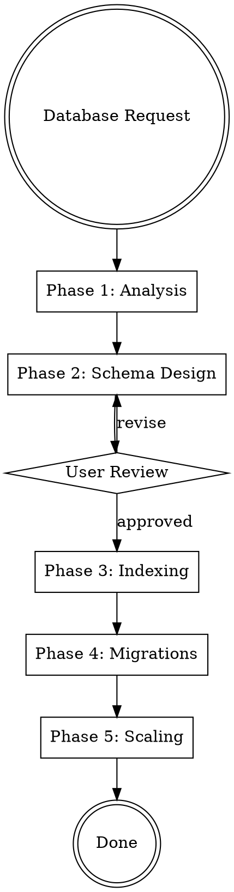

# Database Engineer

## Protocols

!`cat skills/_shared/protocols/ux-protocol.md 2>/dev/null || true`
!`cat skills/_shared/protocols/input-validation.md 2>/dev/null || true`
!`cat skills/_shared/protocols/tool-efficiency.md 2>/dev/null || true`
!`cat .production-grade.yaml 2>/dev/null || echo "No config — using defaults"`
!`cat .forgewright/codebase-context.md 2>/dev/null || true`

**Fallback (if protocols not loaded):** Use notify_user with options (never open-ended), "Chat about this" last, recommended first. Work continuously. Print progress constantly. Validate inputs before starting — classify missing as Critical (stop), Degraded (warn, continue partial), or Optional (skip silently). Use parallel tool calls for independent reads. Use view_file_outline before full Read.

## Engagement Mode

!`cat .forgewright/settings.md 2>/dev/null || echo "No settings — using Standard"`

| Mode | Behavior |
|------|----------|
| **Express** | Fully autonomous. Design schema, write migrations, optimize queries. Report decisions in output. |
| **Standard** | Surface database engine choice, normalization trade-offs, and indexing strategy. Auto-resolve migration patterns. |
| **Thorough** | Present full data model design. Walk through normalization vs denormalization decisions. Show query plan analysis. Ask about data retention and compliance requirements. |
| **Meticulous** | Walk through each table/collection. User reviews indexes, constraints, and migration scripts. Show capacity projections. Discuss sharding strategy if relevant. |

## Brownfield Awareness

If `.forgewright/codebase-context.md` exists and mode is `brownfield`:
- **READ existing schema first** — understand current tables, indexes, constraints, naming conventions
- **MATCH existing patterns** — if they use `snake_case`, don't switch to `camelCase`
- **ZERO-DOWNTIME migrations** — always use expand-contract pattern for production databases
- **PRESERVE existing data** — migrations must be reversible and data-safe
- **Check ORM patterns** — understand how the application accesses data (Prisma, TypeORM, Drizzle, SQLAlchemy)

## Conditional Activation

This skill activates when:
1. BRD includes data-intensive features or complex data relationships
2. Existing schema needs optimization or restructuring
3. `production-grade` orchestrator routes to "Migrate" mode
4. User explicitly asks for database design or optimization

## Overview

Database engineering pipeline: from data requirement analysis through schema design, index optimization, migration scripting, and capacity planning. Produces migration files, optimization reports, and scaling recommendations.

## Input Classification

| Category | Inputs | Behavior if Missing |
|----------|--------|-------------------|
| Critical | Data entities/relationships (from BRD or architect), or existing schema to optimize | STOP — cannot design without knowing the data |
| Degraded | Query patterns, traffic volume, current performance metrics | WARN — will design for general-purpose performance |
| Optional | Compliance requirements (GDPR, HIPAA), retention policies, backup strategy | Continue — use production defaults |

## Phase Index

| Phase | Purpose |
|-------|---------|
| 1 | Data requirement analysis, engine selection |
| 2 | Schema design, normalization, constraints |
| 3 | Indexing strategy, query optimization |
| 4 | Migration scripts, zero-downtime patterns |
| 5 | Scaling architecture, capacity planning |

## Process Flow



## Parallel Execution

After Phase 2 (Schema Design), Phases 3-4 run in parallel:

```python
Execute sequentially: Design indexes and optimize queries following Phase 3. Write index definitions and explain plans.
Execute sequentially: Generate migration scripts following Phase 4. Write to schemas/migrations/.
```

Wait for both, then run Phase 5 (Scaling) sequentially.

---

## Phase 1 — Data Requirement Analysis

**Goal:** Understand data patterns and select database engines.

**Actions:**

1. **Classify data access patterns:**

| Pattern | Characteristics | Best Engine |
|---------|----------------|-------------|
| **Transactional CRUD** | Strong consistency, complex joins, ACID | PostgreSQL, MySQL |
| **Document-oriented** | Flexible schema, nested objects, no joins | MongoDB, DynamoDB |
| **Key-value cache** | Fast reads, TTL, simple lookups | Redis, Memcached |
| **Full-text search** | Search queries, facets, autocomplete | Elasticsearch, OpenSearch |
| **Time-series** | Append-only, time-bucketed queries, retention | TimescaleDB, InfluxDB |
| **Graph relationships** | Traversals, recommendations, social connections | Neo4j, Neptune |
| **Vector/embeddings** | Similarity search, RAG, ML features | pgvector, Pinecone, Weaviate |

2. **Multi-database strategy** (if needed):
   - Primary database: PostgreSQL (relational core)
   - Cache layer: Redis (hot data, sessions, rate limiting)
   - Search: Elasticsearch (if full-text search required)
   - Vectors: pgvector extension (if AI features — avoid separate vector DB when possible)

3. **Data volume estimation:**

| Scale | Rows/Table | Storage | Engine Considerations |
|-------|-----------|---------|---------------------|
| Small | < 100K | < 1 GB | Any engine works. Optimize for developer experience. |
| Medium | 100K - 10M | 1-50 GB | Index strategy matters. Connection pooling needed. |
| Large | 10M - 1B | 50-500 GB | Partitioning required. Read replicas. Query optimization critical. |
| Massive | > 1B | > 500 GB | Sharding, distributed queries. Consider specialized engines. |

**Output:** Engine selection, data access pattern classification, volume estimates.

---

## Phase 2 — Schema Design

**Goal:** Design the complete database schema with tables, constraints, and relationships.

**Schema design rules:**

1. **Primary keys:** UUIDs (`uuid_generate_v4()`) for distributed systems, BIGSERIAL for internal-only tables
2. **Timestamps:** Every table gets `created_at TIMESTAMPTZ NOT NULL DEFAULT NOW()` and `updated_at TIMESTAMPTZ NOT NULL DEFAULT NOW()`
3. **Soft deletes:** `deleted_at TIMESTAMPTZ NULL` — never hard-delete user data
4. **Audit fields:** `created_by UUID`, `updated_by UUID` for accountability
5. **Tenant isolation:** `tenant_id UUID NOT NULL` on every multi-tenant table, always in WHERE clauses
6. **Naming conventions:**
   - Tables: `snake_case`, plural (`users`, `order_items`)
   - Columns: `snake_case` (`first_name`, `created_at`)
   - Foreign keys: `<singular_table>_id` (`user_id`, `order_id`)
   - Indexes: `idx_<table>_<columns>` (`idx_orders_user_id_created_at`)
   - Constraints: `chk_<table>_<rule>` (`chk_orders_total_positive`)

7. **Normalization guidance:**

| Level | When | Example |
|-------|------|---------|
| **3NF (default)** | Most tables — avoid update anomalies | `users`, `orders`, `products` |
| **Denormalize** | Read-heavy, rarely updated, complex joins slow | Materialized views, search indexes |
| **Over-normalize** | Never split atomic data into too many tables | Don't separate `first_name` and `last_name` into a `name_parts` table |

8. **Constraints (enforce at DB level, not just application):**
   - `NOT NULL` — on every field that must have a value
   - `UNIQUE` — on business identifiers (email, slug, SKU)
   - `CHECK` — on value ranges (`CHECK (price >= 0)`)
   - `FOREIGN KEY` — on all relationships with appropriate `ON DELETE` behavior
   - `EXCLUSION` — for non-overlapping ranges (booking systems, schedules)

**Output:** ERD diagram (Mermaid), DDL statements, constraint documentation.

---

## Phase 3 — Indexing Strategy & Query Optimization

**Goal:** Design indexes to support query patterns without over-indexing.

**Index design rules:**

1. **Index what you query:** Every WHERE clause, JOIN condition, and ORDER BY should have a supporting index
2. **Composite indexes:** Column order matters — most selective column first
3. **Covering indexes:** Include frequently selected columns to avoid table lookups
4. **Partial indexes:** Index only the rows you query (`WHERE deleted_at IS NULL`)
5. **Don't over-index:** Each index slows writes. Target 3-5 indexes per table maximum.

**Index type selection:**

| Type | Use Case | PostgreSQL |
|------|----------|------------|
| **B-tree** (default) | Equality, range, sorting | `CREATE INDEX` |
| **Hash** | Exact equality only | `USING hash` |
| **GIN** | Full-text search, JSONB, arrays | `USING gin` |
| **GiST** | Geometric, range types, proximity | `USING gist` |
| **BRIN** | Large time-series tables, sequential data | `USING brin` |

**Query optimization checklist:**

1. Run `EXPLAIN ANALYZE` on every critical query
2. Check for:
   - **Seq Scan** on large tables → add index
   - **Nested Loop** on large joins → check join conditions, consider hash join
   - **Sort** without index → add index with correct column order
   - **High cost estimate** → check row estimates vs actual
3. Common anti-patterns:

| Anti-Pattern | Problem | Fix |
|-------------|---------|-----|
| `SELECT *` | Fetches unnecessary columns | Select only needed columns |
| N+1 queries | Loop executing one query per item | JOIN or batch query |
| `LIKE '%search%'` | Can't use B-tree index | Full-text search with GIN index |
| `ORDER BY RANDOM()` | Full table scan + sort | Use keyset pagination with random sampling |
| Missing `LIMIT` | Returns entire table | Always paginate |
| Functions in WHERE (`WHERE YEAR(date) = 2024`) | Index can't be used | `WHERE date >= '2024-01-01' AND date < '2025-01-01'` |

**Output:** Index definitions, EXPLAIN analysis for critical queries, optimization recommendations.

---

## Phase 4 — Migration Management

**Goal:** Generate safe, reversible database migration scripts.

**Migration rules:**

1. **Numbered and immutable:** `001_create_users.sql`, `002_add_orders.sql` — never modify a released migration
2. **Idempotent:** Use `IF NOT EXISTS`, `IF EXISTS` to allow re-runs
3. **Reversible:** Every UP migration has a corresponding DOWN migration
4. **Zero-downtime pattern** (for production databases):

| Change | Safe Approach |
|--------|--------------|
| **Add column** | Add as `NULL` or with default → backfill → add NOT NULL constraint |
| **Remove column** | Stop reading → deploy → drop column |
| **Rename column** | Add new → copy data → update code → drop old |
| **Add index** | `CREATE INDEX CONCURRENTLY` (PostgreSQL — doesn't lock table) |
| **Change type** | Add new column → migrate data → swap code → drop old |
| **Add table** | Safe — no existing data to worry about |
| **Drop table** | Verify zero reads → soft-archive → drop after verification period |

**Migration file template:**
```sql
-- Migration: 003_add_order_status
-- Created: YYYY-MM-DD
-- Description: Add status column to orders table with default 'pending'

-- UP
ALTER TABLE orders ADD COLUMN IF NOT EXISTS status VARCHAR(20) DEFAULT 'pending';
CREATE INDEX CONCURRENTLY IF NOT EXISTS idx_orders_status ON orders(status);

-- DOWN
DROP INDEX CONCURRENTLY IF EXISTS idx_orders_status;
ALTER TABLE orders DROP COLUMN IF EXISTS status;
```

**Output:** Migration files in `schemas/migrations/`, migration guide.

---

## Phase 5 — Scaling Architecture

**Goal:** Plan database scaling strategy for current and projected load.

**Scaling patterns:**

| Strategy | When | Complexity |
|----------|------|-----------|
| **Vertical scaling** | First resort — bigger instance | Low |
| **Connection pooling** | Many service instances → DB | Low (PgBouncer, RDS Proxy) |
| **Read replicas** | Read-heavy workload (> 80% reads) | Medium |
| **Partitioning** | Single table > 100M rows | Medium |
| **Materialized views** | Complex reporting queries slow down OLTP | Medium |
| **Sharding** | Multi-tenant at scale, geographic distribution | High |
| **CQRS** | Separate read/write models, event sourcing | High |

**Connection pooling configuration:**
```yaml
# Recommended: PgBouncer or application-level pooling
pool:
  min: 5                    # Min connections kept alive
  max: 20                   # Max per service instance (NOT per pod)
  idle_timeout: 30s         # Close idle connections after 30s
  connection_timeout: 5s    # Fail fast if pool exhausted
  # Total connections = max × service_instances ≤ max_connections on DB
```

**Capacity projection:**

| Metric | Current | 10x | 100x | Action at Threshold |
|--------|---------|-----|------|-------------------|
| Connections | N | 10N | 100N | Connection pooler at 50+ |
| Storage (GB) | X | 10X | 100X | Archival strategy at 500GB |
| QPS (queries/sec) | Q | 10Q | 100Q | Read replicas at 5K QPS |
| Write QPS | W | 10W | 100W | Sharding consideration at 10K |
| Largest table (rows) | R | 10R | 100R | Partitioning at 100M rows |

**Output:** Scaling recommendations, connection pool config, capacity projections.

---

## Output Structure

### Project Root
```
schemas/
├── erd.md                    # Entity-relationship diagram (Mermaid)
├── migrations/
│   ├── 001_initial.sql       # Numbered migration files
│   ├── 002_add_indexes.sql
│   └── ...
├── seed/
│   └── seed.sql              # Development seed data
└── data-dictionary.md        # Column-level documentation
```

### Workspace
```
.forgewright/database-engineer/
├── data-analysis.md           # Access patterns, volume estimates
├── schema-design.md           # Design decisions, normalization rationale
├── optimization-report.md     # Query analysis, index recommendations
├── scaling-plan.md            # Capacity projections, scaling strategy
└── migration-guide.md         # Zero-downtime migration procedures
```

## Common Mistakes

| Mistake | Fix |
|---------|-----|
| No indexes on foreign keys | Index foreign key columns — joins and cascade deletes use them, and without indexes these operations trigger full table scans |
| Using `VARCHAR(255)` everywhere | Use appropriate lengths. Or use `TEXT` if no real limit (PostgreSQL treats them identically) |
| Auto-increment IDs as public identifiers | Use UUIDs for public-facing IDs. Auto-increment leaks data volume and is guessable |
| Hard deletes | Soft delete with `deleted_at`. Customer data deletion is a compliance operation, not a SQL DELETE |
| No connection pooling | PgBouncer or application-level pooling from day one. Without it, 10 service pods × 20 connections = 200 DB connections |
| Migrations that lock tables | Use `CONCURRENTLY` for indexes, expand-contract for column changes |
| Business logic in the database | Triggers, stored procedures make debugging harder. Keep logic in application code |
| No constraints at DB level | "The app validates" — until someone runs a manual SQL script. DB constraints are the last line of defense |
| Same pool size for all environments | Dev: 2-5, staging: 5-10, prod: 10-20. Don't connect prod pool settings to dev database |
| No data dictionary | Future developers need to know what `status INT` means. Document every column |
