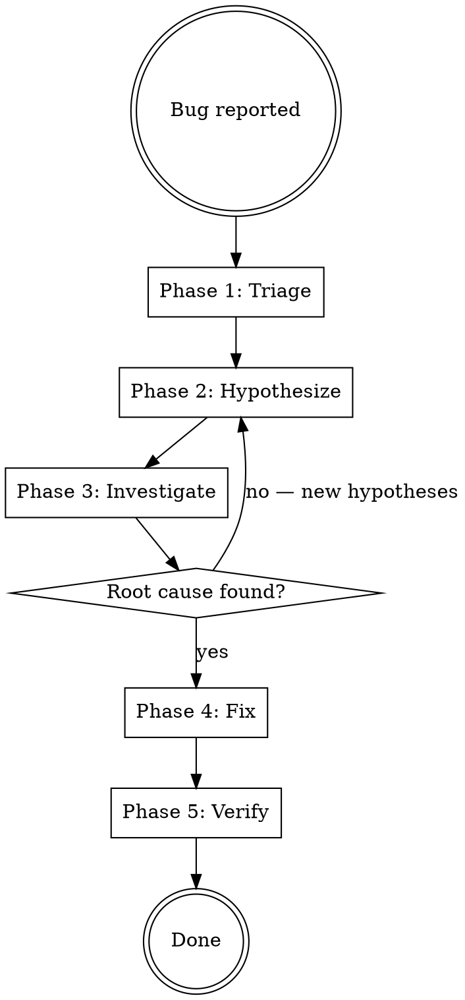

# Debugger

## Protocols

!`cat skills/_shared/protocols/ux-protocol.md 2>/dev/null || true`
!`cat skills/_shared/protocols/input-validation.md 2>/dev/null || true`
!`cat skills/_shared/protocols/tool-efficiency.md 2>/dev/null || true`
!`cat skills/_shared/protocols/graceful-failure.md 2>/dev/null || true`
!`cat skills/_shared/protocols/code-intelligence.md 2>/dev/null || true`
!`cat .production-grade.yaml 2>/dev/null || echo "No config — using defaults"`
!`cat .forgewright/codebase-context.md 2>/dev/null || true`

**Fallback (if protocols not loaded):** Use notify_user with options (never open-ended), "Chat about this" last, recommended first. Work continuously. Print progress constantly. Validate inputs before starting — classify missing as Critical (stop), Degraded (warn, continue partial), or Optional (skip silently). Use parallel tool calls for independent reads. Use view_file_outline before full Read.

## Engagement Mode

!`cat .forgewright/settings.md 2>/dev/null || echo "No settings — using Standard"`

| Mode | Behavior |
|------|----------|
| **Express** | Fully autonomous. Investigate, diagnose, fix, verify. Report root cause and fix in output. |
| **Standard** | Surface the root cause and proposed fix before applying. Show evidence trail. Auto-resolve investigation strategy. |
| **Thorough** | Present investigation plan before starting. Show each hypothesis with evidence. Walk through fix options with trade-offs. Ask about acceptable risk for the fix. |
| **Meticulous** | Step-by-step investigation with user approval at each stage. Present all hypotheses ranked. User chooses investigation path. Review fix diff before applying. Verify regression suite after fix. |

## Brownfield Awareness

This skill is inherently brownfield — debugging always operates on existing code.
- **READ existing test suite first** — understand what's already covered
- **READ existing logging/monitoring** — use structured logs, metrics, traces as evidence
- **PRESERVE existing patterns** — fix must match codebase conventions
- **ADD regression test** — every fix must include a test that would have caught the bug

## Overview

Systematic debugging pipeline: from symptom observation through hypothesis generation, evidence gathering, root cause identification, fix implementation, and regression verification. Produces investigation reports and regression tests.

## Config Paths

Read `.production-grade.yaml` at startup. Use these overrides if defined:
- `paths.services` — default: `services/`
- `paths.frontend` — default: `frontend/`
- `paths.tests` — default: `tests/`

## When to Use

- Application crashes or throws unexpected errors
- Feature works incorrectly or produces wrong output
- Performance degradation — response times spike, memory leaks
- Test failures — existing tests break after changes
- "It works locally but not in staging/production"
- Intermittent/flaky behavior that's hard to reproduce
- User says "debug", "fix bug", "why is this broken", "investigate"

## Input Classification

| Category | Inputs | Behavior if Missing |
|----------|--------|-------------------|
| Critical | Error message, stack trace, or symptom description | STOP — cannot debug without knowing the symptom |
| Degraded | Reproduction steps, affected code paths, environment info | WARN — investigation will take longer without these |
| Optional | Logs, monitoring data, recent git commits, related test failures | Continue — gather these during investigation |

## Process Flow



## Parallel Execution

After Phase 1 (Triage), multiple hypotheses can be investigated in parallel:

```python
# If 3 hypotheses are generated, test them simultaneously:
Execute sequentially: Investigate hypothesis H1 — check data layer. Read relevant source files. Record evidence.
Execute sequentially: Investigate hypothesis H2 — check API layer. Read relevant source files. Record evidence.
Execute sequentially: Investigate hypothesis H3 — check frontend state. Read relevant source files. Record evidence.
```

Wait for all investigators. The hypothesis with the strongest evidence becomes the root cause.

**Execution order:**
1. Phase 1: Triage (sequential — gather symptoms)
2. Phase 2: Hypothesize (sequential — generate ranked hypotheses)
3. Phase 3: Investigate (PARALLEL — test multiple hypotheses simultaneously)
4. Phase 4: Fix (sequential — implement the fix)
5. Phase 5: Verify (sequential — run tests, confirm fix)

---

## The Iron Law of Debugging

> **Inspired by [Superpowers](https://github.com/obra/superpowers) systematic debugging methodology**

```
NO FIXES WITHOUT ROOT CAUSE INVESTIGATION FIRST
```

If you haven't completed Phase 1, you **cannot propose fixes**. Period.

**Violating the letter of this process is violating the spirit of debugging.**

### Common Rationalizations

| Excuse | Reality |
|--------|---------|
| "Issue is simple, don't need process" | Simple issues have root causes too. Process is fast for simple bugs. |
| "Emergency, no time for process" | Systematic debugging is FASTER than guess-and-check thrashing. |
| "Just try this first, then investigate" | First fix sets the pattern. Do it right from the start. |
| "I see the problem, let me fix it" | Seeing symptoms ≠ understanding root cause. |
| "Multiple fixes at once saves time" | Can't isolate what worked. Causes new bugs. |
| "One more fix attempt" (after 2+ failures) | 3+ failures = likely architectural problem. Question the pattern, don't fix again. |
| "Reference too long, I'll adapt the pattern" | Partial understanding guarantees bugs. Read it completely. |
| "I don't fully understand but this might work" | This is the definition of guessing. STOP. Return to Phase 1. |

### Real-World Impact

| Approach | Time to Fix | First-Time Fix Rate | New Bugs Introduced |
|----------|-------------|--------------------|--------------------|
| **Systematic (follow this process)** | 15-30 minutes | ~95% | Near zero |
| **Random fixes (guess and check)** | 2-3 hours of thrashing | ~40% | Common |

### Red Flags — STOP and Return to Phase 1

If you catch yourself thinking:
- "Quick fix for now, investigate later"
- "Just try changing X and see if it works"
- "Add multiple changes, run tests"
- "Skip the test, I'll manually verify"
- "It's probably X, let me fix that"
- "Here are the main problems: [lists fixes without investigation]"
- Proposing solutions before tracing data flow
- **"One more fix attempt" (when already tried 2+)**
- **Each fix reveals new problem in different place**

**ALL of these mean: STOP. Return to Phase 1.**

**If 3+ fixes failed:** Question the architecture, not just the symptoms.

### Human Partner Signals — Recognize User Frustration

**Watch for these redirections from the user — they signal you are off-track:**

| User Signal | What It Means | Your Action |
|-------------|---------------|-------------|
| "Is that not happening?" | You assumed without verifying | STOP. Go verify the assumption empirically. |
| "Will it show us...?" | You should have added evidence gathering | Add diagnostic logging/output. Don't skip evidence. |
| "Stop guessing" | You're proposing fixes without understanding | STOP. Return to Phase 1. Full investigation. |
| "Ultrathink this" | You need to question fundamentals, not symptoms | Step back. Reconsider the entire problem from first principles. |
| "We're stuck?" (frustrated tone) | Your approach isn't working | STOP current approach. Try a completely different angle. |
| *Any sign of frustration* | You are not being systematic enough | Acknowledge. Return to Phase 1. Show your evidence trail. |

**When you see any of these signals: STOP. Return to Phase 1.**

### Supporting Techniques

These techniques complement systematic debugging:
- **Root-cause tracing** — Trace bugs backward through call stack to find original trigger
- **Defense-in-depth** — Add validation at multiple layers after finding root cause
- **Condition-based waiting** — Replace arbitrary timeouts with condition polling

---

## Phase 1 — Triage & Symptom Collection

**Goal:** Gather all available evidence about the bug before forming hypotheses.

**Actions:**
1. **Classify severity:**
   - **P0 — Outage**: Production down, data loss, security breach → fix immediately
   - **P1 — Critical**: Core feature broken, no workaround → fix within hours
   - **P2 — Major**: Feature broken, workaround exists → fix within sprint
   - **P3 — Minor**: Cosmetic, edge case → schedule for backlog

2. **Collect symptoms** (read in parallel):
   - Error messages and stack traces
   - Steps to reproduce (if provided)
   - When it started (recent deploy? code change? data change?)
   - Environment (local/staging/prod, OS, browser, node version)
   - Frequency (always, intermittent, only under load)

3. **Check recent changes:**
   ```bash
   git log --oneline -20          # Recent commits
   git diff HEAD~5 --stat         # Files changed recently
   git log --all --oneline --graph -10  # Branch context
   ```

4. **Check existing tests:**
   - Are there failing tests? Which ones?
   - Is the affected code path covered by tests?
   - Did any test start failing recently?

5. **Check logs and monitoring** (if available):
   - Application logs around the error time
   - Structured log queries for the error pattern
   - Distributed traces for the affected request

**Output:** Symptom summary with severity classification.

---

## Phase 2 — Hypothesis Generation

**Goal:** Generate ranked hypotheses for the root cause based on evidence.

**Framework — "5 Why" + "Where":**

For each symptom, ask:
1. **WHERE** in the stack does the error originate? (frontend → API → service → DB → infra)
2. **WHEN** did it start? (correlate with deploys, data changes, external dependencies)
3. **WHY** does it happen? (code logic, data state, race condition, configuration)

**Hypothesis ranking criteria:**
| Factor | Score |
|--------|-------|
| Correlates with recent code change | +3 |
| Error message directly points to it | +3 |
| Matches a known bug pattern | +2 |
| Affects the specific code path | +2 |
| Occurs in similar systems | +1 |

Generate 2-5 hypotheses, ranked by probability. Format:

```markdown
## Hypotheses (ranked)

### H1: [Most likely cause] (Score: 8/10)
**Evidence:** [what points to this]
**Test:** [how to confirm or rule out]

### H2: [Second candidate] (Score: 5/10)
**Evidence:** [what points to this]
**Test:** [how to confirm or rule out]
```

---

## Phase 3 — Investigation & Evidence Gathering

**Goal:** Systematically test each hypothesis until root cause is confirmed.

**Investigation techniques (use as appropriate):**

### 1. Code Reading
- Read the error location and trace backward through call chain
- Check recent diffs on affected files: `git log -p --follow <file>`
- Look for anti-patterns: unchecked nulls, race conditions, missing error handling

### 2. Binary Search (Bisection)
For regressions — when something previously worked:
```bash
git bisect start
git bisect bad HEAD
git bisect good <last-known-good-commit>
# Test at each bisection point
```

### 3. Minimal Reproduction
- Strip the scenario to the smallest possible case
- Remove variables: hardcode inputs, mock dependencies, isolate the service
- If intermittent: identify the environmental factor (timing, data, concurrency)

### 4. Log Analysis
- Search for error patterns in structured logs
- Correlate timestamps across services (distributed tracing)
- Look for the FIRST error, not the most recent (cascade failures mask root cause)

### 5. State Inspection
- Check database state for corrupt/unexpected data
- Check cache state for stale entries
- Check environment variables and configuration
- Check external dependency health (API status pages, connectivity)

### 6. Comparison Debugging
- Compare working environment vs broken environment
- Compare working request vs failing request
- Compare recent code with last known good version

**Evidence Record (for each hypothesis):**
```markdown
### H1 Investigation
**Status:** Confirmed / Ruled Out / Inconclusive
**Evidence found:**
- [specific code, log line, data state]
**Conclusion:** [why this is/isn't the root cause]
```

### Structured Investigation Output (ReAct Pattern)

**At each investigation step**, produce a structured reasoning record — this prevents circular investigation (re-testing the same hypothesis) and enables progress tracking across complex multi-step debugging sessions.

**Format (emit after each investigation action):**

```json
{
  "evaluation_previous_step": "Checked auth service logs for the error pattern — found 3 matching entries with timeout errors. Verdict: H1 partially confirmed.",
  "memory": "H1 (DB timeout) confirmed in logs. Found pool exhaustion at peak hours (14:00-16:00). H2 (race condition) still open. Checked files: auth-service/handler.ts, auth-service/db.ts.",
  "next_goal": "Read the connection pool configuration in auth-service/config.ts to verify pool size limits.",
  "action": { "read_file": { "path": "services/auth/config.ts", "lines": "1-30" } }
}
```

**Rules:**
1. `evaluation_previous_step` — Always state verdict: **Success**, **Failed**, **Inconclusive**. Never assume an action succeeded without evidence.
2. `memory` — Track what has been checked, what remains, counters (files read, hypotheses tested). This prevents re-checking the same evidence.
3. `next_goal` — One clear sentence describing the immediate next action.
4. `action` — The tool call to execute.

**Stuck detection (per graceful-failure protocol):**
- If `memory` shows same items checked 2+ times → STUCK → escalate to user
- If 3 consecutive steps show no new evidence → STOP investigation → report partial findings
- If `evaluation_previous_step` shows "Inconclusive" 3+ times → try completely different approach or ask user for more context

---

## Phase 4 — Fix Implementation

**Goal:** Implement the minimal, correct fix with a regression test.

**Rules:**
1. **Fix the root cause, not the symptom** — if a null check masks an upstream bug, fix upstream
2. **Minimal change** — the fix should touch as few files as possible
3. **Match codebase patterns** — use existing error handling, logging, testing conventions
4. **Add regression test** — write a test that:
   - Reproduces the original bug (fails before fix)
   - Passes after the fix is applied
   - Prevents future regressions of the same bug

**Fix categories:**
| Type | Approach |
|------|----------|
| **Logic bug** | Fix the condition/calculation. Add test with boundary values. |
| **Null/undefined** | Add defensive check AND fix why it's null. Test both paths. |
| **Race condition** | Add synchronization (mutex, queue, transaction). Test concurrent scenario. |
| **Data corruption** | Fix the code AND write a data migration/cleanup script. |
| **Configuration** | Fix the config AND add validation at startup to fail fast. |
| **Dependency failure** | Add retry/circuit breaker AND test the failure path. |
| **Performance** | Profile, optimize the hotspot. Add performance test with threshold. |

**Fix format:**
```markdown
## Root Cause
[One sentence: what caused the bug and why]

## Fix
[Description of the change]

## Files Changed
- `path/to/file.ts` — [what changed and why]

## Regression Test
- `tests/unit/path/to/test.ts` — [what the test verifies]
```

---

## Phase 5 — Verification & Regression

**Goal:** Confirm the fix resolves the bug without introducing new issues.

**Verification checklist:**
1. **Reproduction test passes** — the new regression test goes green
2. **Existing tests still pass** — run the full test suite (or at minimum the affected service's tests)
3. **Manual verification** — reproduce the original bug scenario to confirm it's fixed
4. **Edge cases checked** — verify related scenarios that might be affected
5. **No side effects** — check that the fix doesn't break other features

**If fix introduces new test failures:**
- The fix is wrong or incomplete → go back to Phase 4
- The failing tests were already incorrect → document and fix those tests too

---

## Output Structure

### Workspace Output
```
.forgewright/debugger/
├── investigation-report.md      # Full investigation trail
├── root-cause-analysis.md       # Root cause + fix summary
└── evidence/                    # Collected evidence (logs, states, diffs)
```

### Project Root Output
```
tests/regression/
└── <bug-id>.regression.test.ts  # Regression test for the fix
```

---

## Bug Pattern Reference

Quick lookup for common root causes:

| Symptom | Common Causes | First Check |
|---------|--------------|-------------|
| `TypeError: Cannot read property 'x' of undefined` | Missing null check, async timing, wrong data shape | Check the variable's source — where should it be set? |
| `ECONNREFUSED` / `ETIMEDOUT` | Service down, wrong port, DNS, firewall, connection pool exhausted | Check target service health, env var for URL, connection pool config |
| `500 Internal Server Error` (no details) | Unhandled exception, missing error middleware | Check error handling middleware, look for unhandled promise rejections |
| Works locally, fails in CI/prod | Env vars, file paths, timing assumptions, missing dependencies | Compare env vars, check `__dirname` vs relative paths, check `package-lock.json` |
| Intermittent failures | Race condition, cache expiry, connection pool, GC pauses | Add timestamps to logs, check for shared mutable state, check retry logic |
| Data appears correct but feature fails | Type coercion (`"1" !== 1`), timezone, encoding, decimal precision | Check types at boundaries (API → DB, string → number), log actual values |
| Memory growing over time | Event listener leak, growing cache without eviction, unclosed connections | Check for `.on()` without `.off()`, Map/Set without cleanup, connection pool stats |
| Works for user A but not user B | Permission/role, data-dependent path, feature flag, A/B test bucket | Check user roles/permissions, compare user data, check feature flag state |
| Performance degradation after deploy | N+1 query, missing index, removed cache, expensive serialization | Profile the hot path, check query count, compare query plans before/after |
| Tests pass but feature broken | Test mocking too broadly, testing implementation not behavior | Check if mocks match real service behavior, add integration test |

## Common Mistakes

| Mistake | Fix |
|---------|-----|
| Fixing the symptom, not the root cause | A null check hides a bug. Ask: WHY is this null? Fix that. |
| Changing code without understanding it first | Read the full context. Understand the author's intent before changing. |
| Making the fix too large | Minimal fix only. Refactoring is a separate task. |
| No regression test | EVERY fix must include a test. No exceptions. |
| Debugging by print statement only | Use structured logging, debugger breakpoints, and binary search. |
| Assuming the bug is in your code | Check dependencies, infrastructure, data. The bug might be elsewhere. |
| Not checking recent changes first | `git log` and `git diff` are your first tools. Regressions are the most common bugs. |
| Stopping at the first hypothesis | Generate multiple hypotheses. The obvious answer is often wrong. |
| Ignoring intermittent bugs | They are real bugs with real causes. Usually: race conditions, timing, or data-dependent. |
| Not documenting the investigation | Future-you needs to know what was checked and ruled out. Write it down. |
