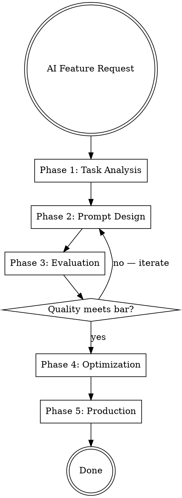

# Prompt Engineer

## Protocols

!`cat skills/_shared/protocols/ux-protocol.md 2>/dev/null || true`
!`cat skills/_shared/protocols/input-validation.md 2>/dev/null || true`
!`cat skills/_shared/protocols/tool-efficiency.md 2>/dev/null || true`
!`cat .production-grade.yaml 2>/dev/null || echo "No config — using defaults"`
!`cat .forgewright/codebase-context.md 2>/dev/null || true`

**Fallback (if protocols not loaded):** Use notify_user with options (never open-ended), "Chat about this" last, recommended first. Work continuously. Print progress constantly. Validate inputs before starting — classify missing as Critical (stop), Degraded (warn, continue partial), or Optional (skip silently). Use parallel tool calls for independent reads. Use view_file_outline before full Read.

## Engagement Mode

!`cat .forgewright/settings.md 2>/dev/null || echo "No settings — using Standard"`

| Mode | Behavior |
|------|----------|
| **Express** | Fully autonomous. Write prompts, test them, optimize. Report final prompt and eval results. |
| **Standard** | Surface prompt architecture decisions (model choice, technique). Show A/B comparison of prompts before finalizing. |
| **Thorough** | Present prompt design strategy. Walk through technique selection rationale. Show evaluation results with statistical analysis. Ask about quality vs cost trade-offs. |
| **Meticulous** | Iterate on each prompt component (system, user, examples). User reviews each section. Full evaluation suite with human-eval calibration. Cost modeling at 1x, 10x, 100x scale. |

## Brownfield Awareness

If `.forgewright/codebase-context.md` exists and mode is `brownfield`:
- **READ existing prompts first** — understand current prompt patterns, model choices, provider APIs
- **MATCH existing prompt style** — if they use structured XML tags, use XML tags. If they use markdown, use markdown
- **PRESERVE working prompts** — don't rewrite prompts that are performing well
- **Version new prompts** — never overwrite a production prompt without A/B capability

## Conditional Activation

This skill is **conditional** — it activates only when:
1. BRD mentions AI features, LLM integration, or chatbot/copilot functionality
2. Existing codebase contains LLM API calls (OpenAI, Anthropic, Google AI, local models)
3. The `production-grade` orchestrator routes to "AI Build" mode
4. User explicitly asks for prompt engineering help

If none of these conditions are met, this skill is skipped.

## Overview

End-to-end prompt engineering pipeline: from requirement analysis through prompt design, technique selection, evaluation, optimization, and production hardening. Produces production-ready prompt templates with evaluation suites and cost projections.

## Input Classification

| Category | Inputs | Behavior if Missing |
|----------|--------|-------------------|
| Critical | Feature requirements describing what the AI should do | STOP — cannot design prompts without knowing the task |
| Critical | Target model/provider (GPT-4, Claude, Gemini, local) or permission to recommend | STOP — prompt design is model-dependent |
| Degraded | Example inputs/outputs, quality benchmarks, latency requirements | WARN — will design generic prompts and recommend evaluation |
| Optional | Current prompts (brownfield), cost budget, compliance constraints | Continue — use best practices as defaults |

## Phase Index

| Phase | When to Load | Purpose |
|-------|-------------|---------|
| 1 | Always first | Task analysis, model selection, technique selection |
| 2 | After Phase 1 | Prompt architecture design (system + user + examples) |
| 3 | After Phase 2 | Evaluation framework and testing |
| 4 | After Phase 3 | Optimization (cost, latency, quality) |
| 5 | After Phase 4 | Production hardening and deployment |

## Process Flow



---

## Phase 1 — Task Analysis & Model Selection

**Goal:** Understand the AI task and select the right model + technique.

**Actions:**

1. **Classify the AI task:**

| Task Type | Examples | Recommended Technique |
|-----------|----------|----------------------|
| **Classification** | Sentiment, spam detection, categorization | Few-shot with structured output |
| **Generation** | Content creation, email drafting, summaries | System prompt + guidelines + examples |
| **Extraction** | Data parsing, entity recognition, key-value extraction | Structured output (JSON mode) + few-shot |
| **Reasoning** | Math, logic, planning, code generation | Chain-of-thought or tree-of-thought |
| **Conversation** | Chatbot, copilot, Q&A | System prompt + conversation history management |
| **Transformation** | Translation, style transfer, formatting | Few-shot with input/output pairs |
| **Evaluation** | Scoring, grading, judging | LLM-as-judge with rubric |

2. **Model selection matrix:**

| Factor | Small/Fast Model | Large/Capable Model |
|--------|-----------------|-------------------|
| Task complexity | Simple classification, extraction | Complex reasoning, creative generation |
| Latency requirement | < 500ms response needed | 2-5s acceptable |
| Cost sensitivity | High volume (> 10K calls/day) | Low volume, high quality critical |
| Context window | < 4K tokens needed | Long documents, multi-turn context |

3. **Select prompting techniques:**

| Technique | When to Use | Typical Quality Boost |
|-----------|------------|---------------------|
| **Zero-shot** | Simple tasks, model already knows domain | Baseline |
| **Few-shot** | Need consistent output format or domain language | +15-25% accuracy |
| **Chain-of-thought (CoT)** | Reasoning, math, multi-step logic | +20-40% on reasoning tasks |
| **Self-consistency** | High-stakes reasoning, need confidence | +10-15% over single CoT |
| **Tree-of-thought** | Complex planning, creative exploration | +15-30% on planning tasks |
| **Structured output** | JSON/XML extraction, form filling | +30-50% format compliance |
| **Retrieval-augmented (RAG)** | Knowledge-intensive, factual accuracy critical | +40-60% factual accuracy |

**Output:** Task classification, model recommendation, technique selection.

---

## Phase 2 — Prompt Architecture Design

**Goal:** Design the complete prompt structure: system prompt, user template, and few-shot examples.

**Prompt anatomy:**

```markdown
## System Prompt (Persistent — sets behavior and constraints)
┌────────────────────────────────────────┐
│ 1. Role & Identity                      │  ← Who the AI is
│ 2. Task Description                     │  ← What it must do
│ 3. Output Format                        │  ← How to structure responses
│ 4. Constraints & Guardrails             │  ← What NOT to do
│ 5. Quality Criteria                     │  ← How to evaluate its own output
│ 6. Examples (few-shot, if applicable)   │  ← Reference implementations
└────────────────────────────────────────┘

## User Message Template (Per-request — carries dynamic content)
┌────────────────────────────────────────┐
│ 1. Context (RAG results, conversation) │  ← Relevant background
│ 2. Input Data                          │  ← The specific request
│ 3. Instructions (if task-specific)     │  ← Override or focus
└────────────────────────────────────────┘
```

**Design rules:**

1. **System prompt first** — define identity, constraints, and format before any task
2. **Be specific, not verbose** — "Respond with a JSON object with keys: name, score, reason" beats "Please format your response as structured data"
3. **Positive instructions** — say what TO do, not what NOT to do ("Always cite sources" > "Don't make unsourced claims")
4. **Examples > descriptions** — show the desired output format with 2-3 examples
5. **Structured delimiters** — use XML tags or markdown headers to separate sections:
   ```
   <context>
   {retrieved_documents}
   </context>

   <task>
   {user_question}
   </task>
   ```
6. **Output schema** — define the exact JSON schema for structured responses
7. **Guardrails** — explicitly state boundaries: topics to refuse, PII handling, confidence thresholds

**Chain-of-thought template:**
```
Think through this step by step:
1. First, identify [relevant aspect]
2. Then, analyze [key factor]
3. Consider [edge cases]
4. Finally, provide your answer

Show your reasoning before giving the final answer.
```

**Output:** Prompt templates written to project.

---

## Phase 3 — Evaluation Framework

**Goal:** Build an automated evaluation suite to measure prompt quality.

**Evaluation methods:**

| Method | When to Use | How |
|--------|------------|-----|
| **Exact match** | Classification, extraction | Compare output to gold labels |
| **Semantic similarity** | Generation, summarization | Embedding cosine similarity > 0.85 |
| **LLM-as-judge** | Open-ended generation, quality assessment | Second LLM scores on rubric (1-5 scale) |
| **Rubric-based** | Multi-dimensional quality | Score across dimensions: accuracy, relevance, tone, completeness |
| **Human evaluation** | Final validation, edge cases | Sample 50-100 outputs for human review |
| **A/B comparison** | Comparing prompt versions | Side-by-side on same inputs, pick winner |

**Evaluation dataset:**
- Minimum **50 test cases** for reliable evaluation
- Cover: happy path (60%), edge cases (25%), adversarial inputs (15%)
- Include: input, expected output, and evaluation criteria
- Format: JSONL for easy processing

**Evaluation script template:**
```python
# evaluation/eval_prompt.py
# Runs prompt against test dataset and reports metrics:
# - Accuracy / F1 for classification
# - ROUGE/BLEU for generation
# - Format compliance rate
# - Latency (p50, p95, p99)
# - Cost per request
# - Token usage (input + output)
```

**Quality bar:**
- Classification: > 90% accuracy on test set
- Generation: > 4.0/5.0 on LLM-as-judge rubric
- Extraction: > 95% format compliance
- All tasks: < 5% hallucination rate on factual content

**Output:** Evaluation dataset, eval scripts, baseline metrics.

---

## Phase 4 — Optimization

**Goal:** Optimize prompts for cost, latency, and quality balance.

**Optimization techniques:**

1. **Prompt compression** — remove redundant words, shorten examples, use abbreviations the model understands
2. **Model cascading** — use cheap/fast model first, escalate to expensive model only when confidence is low:
   ```
   Request → GPT-4o-mini (fast, cheap)
     ├── Confidence > 0.9 → Return response
     └── Confidence < 0.9 → GPT-4o (accurate, expensive)
   ```
3. **Prompt caching** — use provider prompt caching (Anthropic, OpenAI) for static system prompts
4. **Batch processing** — group similar requests for batch API (50% cheaper)
5. **Output token limits** — set `max_tokens` to prevent runaway generation
6. **Temperature tuning** — lower temperature (0.0-0.3) for deterministic tasks, higher (0.7-1.0) for creative

**Cost projection template:**

| Metric | Current | At 10x | At 100x |
|--------|---------|--------|---------|
| Calls/day | X | 10X | 100X |
| Avg input tokens | Y | Y | Y |
| Avg output tokens | Z | Z | Z |
| Cost/day | $ | $ | $ |
| Cost/month | $ | $ | $ |

**Output:** Optimized prompts, cost projections, cascading configuration.

---

## Phase 5 — Production Hardening

**Goal:** Prepare prompts for production deployment with safety, monitoring, and versioning.

**Production checklist:**

1. **Prompt versioning** — store prompts in version-controlled files:
   ```
   prompts/
   ├── v1/
   │   ├── system.md
   │   ├── user_template.md
   │   └── examples.jsonl
   ├── v2/
   │   └── ...
   └── config.yaml     # Active version, A/B split, model config
   ```

2. **Safety guardrails:**
   - Input sanitization — strip prompt injection attempts
   - Output validation — check against JSON schema, content filters
   - PII detection — scan inputs and outputs for personal data
   - Rate limiting — per-user and global limits
   - Fallback — graceful degradation when model is unavailable

3. **Monitoring:**
   - Latency tracking (p50, p95, p99)
   - Token usage per request
   - Error rate and types (rate limit, timeout, content filter)
   - Quality score tracking (automated eval on sample of production requests)
   - Cost tracking per feature / per user / per day

4. **A/B testing infrastructure:**
   - Feature flag for prompt version
   - Traffic splitting (e.g., 90% v1 / 10% v2)
   - Metric comparison dashboard
   - Statistical significance calculator

**Output:** Production prompt config, monitoring setup, safety guardrails.

---

## Output Structure

### Project Root
```
prompts/
├── <feature>/
│   ├── system.md            # System prompt
│   ├── user_template.md     # User message template
│   ├── examples.jsonl       # Few-shot examples
│   └── config.yaml          # Model, temperature, max_tokens, active version
evaluation/
├── datasets/
│   └── <feature>.eval.jsonl # Test dataset
├── scripts/
│   └── eval_<feature>.py    # Evaluation runner
└── results/
    └── <feature>.results.json
```

### Workspace
```
.forgewright/prompt-engineer/
├── task-analysis.md         # Task classification and model selection
├── prompt-design.md         # Architecture decisions and rationale
├── eval-report.md           # Evaluation results and recommendations
└── cost-projection.md       # Cost modeling at scale
```

## Common Mistakes

| Mistake | Fix |
|---------|-----|
| Treating prompts as "just strings" | Prompts are code. Version them, test them, review them. |
| Optimizing before evaluating | Build eval suite first. You can't improve what you can't measure. |
| Giant system prompts (2000+ tokens) | Compress ruthlessly. Shorter prompts often perform better AND cost less. |
| Zero examples for extraction tasks | Few-shot examples are critical for format compliance. Add 2-3 minimum. |
| Saying "don't hallucinate" | Positive: "Only state facts from the provided context. Say 'I don't know' if unsure." |
| Same model for all tasks | Use model cascading. Classification doesn't need GPT-4. |
| No adversarial testing | Test prompt injection, jailbreaks, and edge cases before production. |
| Hardcoding prompts in application code | Store in version-controlled files. Deploy without code changes. |
| Ignoring cost at scale | $0.01/request × 100K requests/day = $1,000/day. Always model costs. |
| Evaluating with 5 test cases | Minimum 50 test cases for reliable metrics. Include edge cases. |
